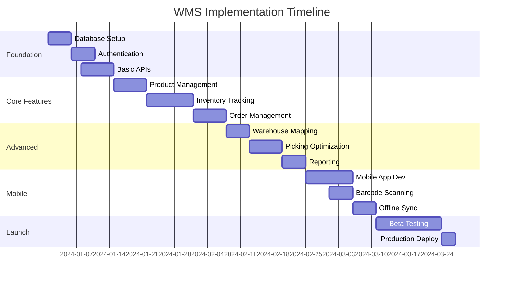

# Inventory Management Systems - SaaS Transformation Plan

## Executive Summary
This document outlines the comprehensive transformation strategy for converting the Inventory Management Systems demo into a fully functional, enterprise-grade Warehouse Management System (WMS) SaaS product. The transformation includes multi-tenancy, robust authentication, real-time inventory tracking, and seamless integrations with existing business systems.

---

## 1. Product Vision & Scope

### Core Value Proposition
A comprehensive cloud-based Warehouse Management System that enables businesses to:
- Manage multiple warehouses with real-time inventory visibility
- Automate order fulfillment workflows from pick to ship
- Optimize warehouse operations through intelligent algorithms
- Scale from small warehouses to large distribution centers

### Key Features
1. **Multi-Warehouse Operations**
   - Location tracking down to bin level (Zone → Aisle → Rack → Bin)
   - Cross-warehouse transfers and visibility
   - Warehouse-specific rules and workflows

2. **Real-time Inventory Tracking**
   - Lot/batch management with full traceability
   - Expiry date tracking and FEFO enforcement
   - Serial number management for high-value items

3. **Automated Reordering**
   - Dynamic reorder point calculations
   - Automatic purchase order generation
   - Supplier performance tracking

4. **Order Fulfillment Workflows**
   - Optimized picking paths
   - Batch and wave picking support
   - Pack verification and shipping integration

5. **Barcode/QR Integration**
   - Mobile scanning for all operations
   - Label printing and generation
   - Support for multiple barcode formats

6. **Integration Capabilities**
   - ERP systems (SAP, Oracle, Dynamics)
   - eCommerce platforms (Shopify, WooCommerce)
   - Shipping carriers (FedEx, UPS, DHL)

### Target Market
- Small to medium warehouses (100-10,000 SKUs)
- 3PL providers and fulfillment centers
- Manufacturing companies with complex inventory
- eCommerce businesses with multi-channel operations

---

## 2. Database Architecture

### Technology Stack
- **Primary Database**: PostgreSQL 15+ with Supabase
- **Caching Layer**: Redis for hot data
- **Search Engine**: PostgreSQL full-text search with pg_trgm
- **Spatial Data**: PostGIS for warehouse mapping

### Core Database Schema

```sql
-- Multi-tenant foundation
CREATE TABLE organizations (
    id UUID PRIMARY KEY DEFAULT gen_random_uuid(),
    name VARCHAR(255) NOT NULL,
    slug VARCHAR(100) UNIQUE NOT NULL,
    subscription_plan VARCHAR(50) DEFAULT 'starter',
    settings JSONB DEFAULT '{}',
    created_at TIMESTAMPTZ DEFAULT NOW()
);

-- Warehouse hierarchy
CREATE TABLE warehouses (
    id UUID PRIMARY KEY DEFAULT gen_random_uuid(),
    org_id UUID REFERENCES organizations(id),
    name VARCHAR(255) NOT NULL,
    code VARCHAR(50) UNIQUE NOT NULL,
    address JSONB,
    timezone VARCHAR(50),
    settings JSONB DEFAULT '{}',
    created_at TIMESTAMPTZ DEFAULT NOW()
);

CREATE TABLE warehouse_zones (
    id UUID PRIMARY KEY DEFAULT gen_random_uuid(),
    warehouse_id UUID REFERENCES warehouses(id),
    name VARCHAR(100) NOT NULL,
    code VARCHAR(20) NOT NULL,
    type VARCHAR(50), -- picking, staging, receiving, shipping
    capacity_units INTEGER,
    UNIQUE(warehouse_id, code)
);

CREATE TABLE locations (
    id UUID PRIMARY KEY DEFAULT gen_random_uuid(),
    zone_id UUID REFERENCES warehouse_zones(id),
    aisle VARCHAR(10),
    rack VARCHAR(10),
    level VARCHAR(10),
    bin VARCHAR(10),
    barcode VARCHAR(100) UNIQUE,
    capacity_volume DECIMAL(10,2),
    capacity_weight DECIMAL(10,2),
    is_active BOOLEAN DEFAULT true,
    UNIQUE(zone_id, aisle, rack, level, bin)
);

-- Product management
CREATE TABLE products (
    id UUID PRIMARY KEY DEFAULT gen_random_uuid(),
    org_id UUID REFERENCES organizations(id),
    sku VARCHAR(100) NOT NULL,
    name VARCHAR(255) NOT NULL,
    description TEXT,
    category_id UUID,
    barcode VARCHAR(100),
    upc VARCHAR(100),
    weight DECIMAL(10,3),
    dimensions JSONB, -- {length, width, height, unit}
    is_kit BOOLEAN DEFAULT false,
    is_perishable BOOLEAN DEFAULT false,
    shelf_life_days INTEGER,
    reorder_point INTEGER,
    reorder_quantity INTEGER,
    settings JSONB DEFAULT '{}',
    UNIQUE(org_id, sku)
);

-- Inventory tracking
CREATE TABLE inventory (
    id UUID PRIMARY KEY DEFAULT gen_random_uuid(),
    product_id UUID REFERENCES products(id),
    location_id UUID REFERENCES locations(id),
    warehouse_id UUID REFERENCES warehouses(id),
    quantity DECIMAL(15,3) NOT NULL,
    available_quantity DECIMAL(15,3) NOT NULL,
    reserved_quantity DECIMAL(15,3) DEFAULT 0,
    lot_number VARCHAR(100),
    serial_number VARCHAR(100),
    expiry_date DATE,
    cost_per_unit DECIMAL(10,2),
    received_date TIMESTAMPTZ,
    last_counted TIMESTAMPTZ,
    UNIQUE(product_id, location_id, lot_number, serial_number)
);

-- Stock movements
CREATE TABLE stock_movements (
    id UUID PRIMARY KEY DEFAULT gen_random_uuid(),
    movement_type VARCHAR(50) NOT NULL, -- receive, pick, adjust, transfer, return
    reference_type VARCHAR(50), -- order, purchase_order, adjustment, transfer
    reference_id UUID,
    product_id UUID REFERENCES products(id),
    from_location_id UUID REFERENCES locations(id),
    to_location_id UUID REFERENCES locations(id),
    quantity DECIMAL(15,3) NOT NULL,
    lot_number VARCHAR(100),
    serial_number VARCHAR(100),
    reason VARCHAR(255),
    performed_by UUID REFERENCES auth.users(id),
    performed_at TIMESTAMPTZ DEFAULT NOW(),
    notes TEXT
);

-- Orders
CREATE TABLE orders (
    id UUID PRIMARY KEY DEFAULT gen_random_uuid(),
    org_id UUID REFERENCES organizations(id),
    order_number VARCHAR(100) UNIQUE NOT NULL,
    customer_id UUID,
    status VARCHAR(50) DEFAULT 'pending',
    priority INTEGER DEFAULT 5,
    order_date TIMESTAMPTZ DEFAULT NOW(),
    required_date TIMESTAMPTZ,
    shipping_address JSONB,
    shipping_method VARCHAR(100),
    tracking_number VARCHAR(255),
    notes TEXT
);

CREATE TABLE order_items (
    id UUID PRIMARY KEY DEFAULT gen_random_uuid(),
    order_id UUID REFERENCES orders(id),
    product_id UUID REFERENCES products(id),
    quantity DECIMAL(15,3) NOT NULL,
    picked_quantity DECIMAL(15,3) DEFAULT 0,
    unit_price DECIMAL(10,2),
    status VARCHAR(50) DEFAULT 'pending'
);

-- Audit trail
CREATE TABLE audit_logs (
    id UUID PRIMARY KEY DEFAULT gen_random_uuid(),
    org_id UUID REFERENCES organizations(id),
    entity_type VARCHAR(50) NOT NULL,
    entity_id UUID NOT NULL,
    action VARCHAR(50) NOT NULL,
    changes JSONB,
    performed_by UUID REFERENCES auth.users(id),
    performed_at TIMESTAMPTZ DEFAULT NOW(),
    ip_address INET,
    user_agent TEXT
);
```

### Multi-tenancy Strategy
- Row Level Security (RLS) policies on all tables
- Tenant isolation at the organization level
- Separate schemas for large enterprise customers
- Connection pooling per tenant for performance

---

## 3. Authentication & Authorization

### Technology
- **Provider**: Supabase Auth with custom claims
- **Session Management**: JWT with 15-minute access tokens, 7-day refresh tokens
- **2FA**: TOTP-based authentication for admin roles

### Role-Based Access Control (RBAC)

| Role | Permissions | Use Case |
|------|------------|----------|
| **Super Admin** | Full system access, tenant management | System administrators |
| **Warehouse Manager** | All warehouse operations, reports, staff management | Warehouse supervisors |
| **Inventory Controller** | Product management, stock adjustments, cycle counts | Inventory team |
| **Warehouse Staff** | Picking, packing, receiving operations | Floor workers |
| **Shipping Clerk** | Process shipments, print labels, update tracking | Shipping department |
| **Purchasing Agent** | Create/manage POs, supplier relationships | Procurement team |
| **Viewer/Auditor** | Read-only access to all data | Compliance, management |
| **Customer Portal** | View own orders, limited inventory visibility | External customers |

### Implementation

```typescript
// Custom claims structure
interface UserClaims {
  org_id: string;
  warehouses: string[];
  role: string;
  permissions: string[];
  warehouse_zones?: string[];
}

// Permission matrix
const permissionMatrix = {
  'warehouse_manager': [
    'inventory:*',
    'orders:*',
    'reports:*',
    'users:read',
    'users:write'
  ],
  'warehouse_staff': [
    'inventory:read',
    'inventory:pick',
    'inventory:pack',
    'orders:read',
    'orders:update_status'
  ],
  'customer_portal': [
    'orders:read_own',
    'inventory:read_available'
  ]
};
```

---

## 4. API Design

### Architecture Pattern
- RESTful APIs for CRUD operations
- GraphQL for complex queries and reporting
- WebSocket connections for real-time updates
- Webhook system for external integrations

### Core API Endpoints

#### Product Management
```
POST   /api/v1/products                 # Create product
GET    /api/v1/products                 # List products with pagination
GET    /api/v1/products/:id             # Get product details
PUT    /api/v1/products/:id             # Update product
DELETE /api/v1/products/:id             # Delete product
POST   /api/v1/products/bulk-import     # Bulk import from CSV/Excel
GET    /api/v1/products/:id/movements   # Product movement history
POST   /api/v1/products/:id/barcode     # Generate barcode
```

#### Inventory Operations
```
GET    /api/v1/inventory/levels         # Current stock levels
POST   /api/v1/inventory/adjust         # Stock adjustment
POST   /api/v1/inventory/transfer       # Transfer between locations
POST   /api/v1/inventory/count          # Cycle count entry
GET    /api/v1/inventory/availability   # Available to promise
POST   /api/v1/inventory/reserve        # Reserve stock for order
GET    /api/v1/inventory/lot/:lot       # Lot traceability
```

#### Warehouse Management
```
GET    /api/v1/warehouses                # List warehouses
POST   /api/v1/warehouses/:id/zones     # Create zone
GET    /api/v1/warehouses/:id/map       # Warehouse layout
POST   /api/v1/warehouses/:id/locations # Create location
PUT    /api/v1/locations/:id/capacity   # Update location capacity
GET    /api/v1/locations/:id/contents   # Location inventory
```

#### Order Processing
```
POST   /api/v1/orders                   # Create order
GET    /api/v1/orders/:id/pick-list     # Generate pick list
POST   /api/v1/orders/:id/pick          # Record pick
POST   /api/v1/orders/:id/pack          # Pack verification
POST   /api/v1/orders/:id/ship          # Mark as shipped
GET    /api/v1/orders/:id/documents     # Packing slip, labels
POST   /api/v1/orders/batch-pick        # Batch picking
```

#### Mobile-Optimized APIs
```
POST   /api/v1/mobile/scan              # Process barcode scan
GET    /api/v1/mobile/task-list         # Worker task queue
POST   /api/v1/mobile/complete-task     # Mark task complete
POST   /api/v1/mobile/offline-sync      # Sync offline operations
```

### API Standards
- Consistent pagination: `?page=1&limit=50&sort=created_at:desc`
- Filtering: `?filter[status]=active&filter[warehouse_id]=123`
- Field selection: `?fields=id,name,sku,quantity`
- Rate limiting: 1000 req/min per tenant
- Response caching with ETags

---

## 5. Frontend Architecture

### Technology Stack
- **Framework**: Next.js 14 with App Router
- **Language**: TypeScript 5.0+
- **Styling**: Tailwind CSS + Shadcn UI
- **State Management**: Zustand for global state
- **Data Fetching**: TanStack Query v5
- **Forms**: React Hook Form + Zod validation
- **Charts**: Recharts for analytics
- **Mobile**: React Native for mobile apps

### Application Structure

```
/app
├── (auth)
│   ├── login
│   └── register
├── (dashboard)
│   ├── overview              # Main dashboard
│   ├── inventory
│   │   ├── products         # Product catalog
│   │   ├── stock-levels      # Current inventory
│   │   ├── adjustments       # Stock adjustments
│   │   └── movements         # Movement history
│   ├── warehouses
│   │   ├── [id]
│   │   │   ├── layout        # Visual warehouse map
│   │   │   ├── zones         # Zone management
│   │   │   └── locations     # Location management
│   ├── orders
│   │   ├── list              # Order queue
│   │   ├── [id]              # Order details
│   │   ├── picking           # Pick interface
│   │   └── packing           # Pack station
│   ├── receiving
│   │   ├── purchase-orders   # PO receiving
│   │   └── returns           # Return processing
│   ├── reports
│   │   ├── analytics         # Dashboard analytics
│   │   ├── custom            # Report builder
│   │   └── scheduled         # Scheduled reports
│   └── settings
│       ├── organization      # Org settings
│       ├── users             # User management
│       └── integrations      # API connections
└── (mobile)
    ├── scan                   # Barcode scanner
    ├── pick                   # Mobile picking
    └── tasks                  # Task queue
```

### Key UI Components

1. **Dashboard KPIs**
   - Real-time inventory value
   - Orders pending fulfillment
   - Low stock alerts
   - Daily pick/pack metrics

2. **Warehouse Visualizer**
   - 2D/3D warehouse layout
   - Heat maps of activity
   - Drag-drop location management
   - Real-time occupancy

3. **Product Management**
   - Advanced filtering and search
   - Bulk edit capabilities
   - Image management
   - Variant/kit configuration

4. **Pick Interface**
   - Optimized pick path display
   - Barcode verification
   - Exception handling
   - Batch picking support

5. **Mobile PWA Features**
   - Offline mode with sync
   - Camera-based scanning
   - Voice picking support
   - Push notifications

---

## 6. Backend Services

### Microservices Architecture

```yaml
services:
  # Core API Gateway
  api-gateway:
    tech: Node.js + Express
    responsibilities:
      - Request routing
      - Authentication
      - Rate limiting
      - Response caching

  # Inventory Engine
  inventory-service:
    tech: Node.js + PostgreSQL
    responsibilities:
      - Stock calculations
      - Available-to-promise logic
      - Reservation management
      - Lot/serial tracking

  # Reorder Engine
  reorder-service:
    tech: Python + Pandas
    responsibilities:
      - Safety stock calculations
      - Lead time analysis
      - Demand forecasting
      - Automatic PO generation

  # Pick Path Optimizer
  picking-service:
    tech: Python + NetworkX
    responsibilities:
      - Shortest path calculation
      - Batch optimization
      - Zone picking logic
      - Workload balancing

  # Allocation Engine
  allocation-service:
    tech: Node.js
    responsibilities:
      - Order prioritization
      - Stock allocation rules
      - Backorder management
      - Fair share distribution

  # Integration Service
  integration-service:
    tech: Node.js + Bull Queue
    responsibilities:
      - EDI processing
      - Webhook management
      - External API calls
      - Data transformation

  # Notification Service
  notification-service:
    tech: Node.js + SendGrid/Twilio
    responsibilities:
      - Email notifications
      - SMS alerts
      - Push notifications
      - In-app messages

  # Reporting Service
  reporting-service:
    tech: Node.js + Puppeteer
    responsibilities:
      - Report generation
      - PDF/Excel export
      - Scheduled reports
      - Custom queries
```

### Message Queue Architecture
- **Queue System**: Bull (Redis-based)
- **Job Types**:
  - Stock recalculation
  - Report generation
  - Integration sync
  - Notification dispatch
  - Audit log processing

### Real-time Updates
- **Technology**: Socket.io
- **Channels**:
  - Inventory changes
  - Order status updates
  - Pick/pack progress
  - System alerts

---

## 7. Technical Stack Recommendations

### Core Infrastructure

| Component | Technology | Justification |
|-----------|------------|---------------|
| **Database** | Supabase/PostgreSQL | ACID compliance, RLS, real-time subscriptions |
| **Cache** | Redis | Sub-millisecond latency for hot data |
| **Search** | PostgreSQL + pg_trgm | Full-text search without additional infrastructure |
| **File Storage** | Supabase Storage / S3 | Scalable document and image storage |
| **CDN** | Cloudflare | Global edge caching, DDoS protection |

### Backend Technologies

| Component | Technology | Justification |
|-----------|------------|---------------|
| **API Framework** | Node.js + Express | JavaScript ecosystem, async performance |
| **Queue System** | Bull + Redis | Reliable job processing, retry logic |
| **Real-time** | Socket.io | WebSocket with fallbacks |
| **Scheduler** | node-cron | Background job scheduling |
| **Email** | SendGrid | Reliable delivery, templates |
| **SMS** | Twilio | Global coverage, programmable SMS |

### Frontend Technologies

| Component | Technology | Justification |
|-----------|------------|---------------|
| **Framework** | Next.js 14 | SSR, App Router, built-in optimizations |
| **UI Library** | Shadcn UI | Customizable, accessible components |
| **State** | Zustand | Simple, performant state management |
| **Data Fetching** | TanStack Query | Caching, optimistic updates |
| **Forms** | React Hook Form | Performance, validation |
| **Mobile** | React Native | Code sharing, native performance |

### Integration Technologies

| Component | Technology | Use Case |
|-----------|------------|----------|
| **Shipping** | Shippo/EasyPost | Multi-carrier integration |
| **Payments** | Stripe | Subscription billing |
| **Accounting** | QuickBooks API | Financial sync |
| **eCommerce** | Shopify API | Order import |
| **Barcodes** | ZXing.js | Client-side scanning |
| **EDI** | AS2 Gateway | B2B transactions |

### Monitoring & DevOps

| Component | Technology | Purpose |
|-----------|------------|---------|
| **Error Tracking** | Sentry | Real-time error monitoring |
| **APM** | DataDog | Performance monitoring |
| **Logging** | LogRocket | Session replay, debugging |
| **CI/CD** | GitHub Actions | Automated deployment |
| **Hosting** | Vercel (Frontend) / Railway (Backend) | Auto-scaling, global deployment |

---

## 8. Migration Path

### Phase 1: Foundation (Weeks 1-2)
**Goal**: Set up core infrastructure and authentication

- [ ] Initialize Supabase project with multi-tenant schema
- [ ] Implement authentication system with roles
- [ ] Create basic CRUD APIs for products and warehouses
- [ ] Set up development environment and CI/CD pipeline
- [ ] Deploy basic dashboard with login

### Phase 2: Core Features (Weeks 3-4)
**Goal**: Migrate demo components to use real database

- [ ] Connect WarehouseManagement component to database
- [ ] Implement product catalog with real data
- [ ] Add stock level tracking and movements
- [ ] Create order management workflow
- [ ] Implement form validation and error handling

### Phase 3: Inventory Engine (Weeks 5-6)
**Goal**: Build robust inventory tracking system

- [ ] Develop stock movement APIs
- [ ] Implement lot/batch tracking
- [ ] Add cycle counting functionality
- [ ] Create inventory adjustment workflows
- [ ] Build location management system

### Phase 4: Order Fulfillment (Weeks 7-8)
**Goal**: Complete order processing workflow

- [ ] Develop picking interface with optimization
- [ ] Implement packing station functionality
- [ ] Add shipping label generation
- [ ] Create order tracking system
- [ ] Build returns processing

### Phase 5: Analytics & Reporting (Weeks 9-10)
**Goal**: Add business intelligence features

- [ ] Create analytics dashboard
- [ ] Implement custom report builder
- [ ] Add scheduled report generation
- [ ] Build audit trail system
- [ ] Develop KPI tracking

### Phase 6: Mobile & Scanning (Weeks 11-12)
**Goal**: Deploy mobile capabilities

- [ ] Develop React Native mobile app
- [ ] Implement barcode scanning
- [ ] Add offline mode with sync
- [ ] Create mobile picking interface
- [ ] Deploy PWA version

### Phase 7: Beta Launch (Weeks 13-16)
**Goal**: Launch with pilot customers

- [ ] Onboard 10-20 beta customers
- [ ] Implement feedback collection system
- [ ] Create data migration tools
- [ ] Develop training materials
- [ ] Performance optimization
- [ ] Security audit

### Phase 8: Production Launch (Month 5-6)
**Goal**: Full market launch

- [ ] Scale infrastructure for growth
- [ ] Implement billing system
- [ ] Launch marketing website
- [ ] Create customer support system
- [ ] Begin integration partnerships

---

## 9. Inventory-Specific Features

### Advanced Capabilities

1. **Lot/Batch Management**
   - Full traceability from receipt to shipment
   - FIFO/FEFO/LIFO costing methods
   - Recall management with affected customer notification
   - Batch picking for similar lots

2. **Cycle Counting**
   - ABC classification automation
   - Scheduled count generation
   - Blind counting option
   - Variance reporting and approval workflow

3. **Kitting & Bundling**
   - Dynamic kit assembly
   - BOM explosion for picks
   - Component availability checking
   - Kit cost calculation

4. **Cross-docking**
   - Direct receipt-to-ship workflows
   - Minimal storage time tracking
   - Priority lane assignment
   - Performance metrics

5. **Serial Number Tracking**
   - Unique item identification
   - Warranty period tracking
   - Return/RMA management
   - Service history

6. **Expiry Management**
   - Automatic FEFO enforcement
   - Expiry alerts and notifications
   - Disposal workflow
   - Shelf life extension tracking

7. **Consignment Inventory**
   - Vendor-owned stock tracking
   - Usage-based billing
   - Separate ownership reporting
   - Automatic reorder from vendor

8. **Multi-UOM Support**
   - Unit conversion tables
   - Packaging hierarchy (each/case/pallet)
   - Automatic conversion in picks
   - Flexible receiving units

---

## 10. Integration Ecosystem

### ERP Integrations

| System | Integration Method | Sync Frequency | Data Points |
|--------|-------------------|----------------|-------------|
| SAP | REST API + IDoc | Real-time | Products, orders, inventory |
| Oracle NetSuite | SuiteScript + REST | 15 minutes | Full bi-directional |
| Microsoft Dynamics | OData + Webhooks | Real-time | All entities |
| QuickBooks | REST API | Hourly | Products, customers, invoices |

### eCommerce Platforms

| Platform | Integration | Features |
|----------|-------------|----------|
| Shopify | GraphQL API | Real-time inventory sync, order import, fulfillment updates |
| WooCommerce | REST API | Product catalog sync, order management, stock updates |
| Magento | REST API | Multi-channel inventory, order routing, customer sync |
| Amazon | SP-API | FBA/FBM inventory, order download, shipment confirmation |

### Shipping Carriers

```typescript
// Unified shipping interface
interface ShippingIntegration {
  carriers: {
    fedex: { account_id: string, key: string },
    ups: { account_id: string, password: string },
    dhl: { account_id: string, api_key: string },
    usps: { user_id: string }
  },
  features: [
    'rate_shopping',
    'label_generation',
    'tracking_updates',
    'address_validation',
    'pickup_scheduling'
  ]
}
```

### Marketplace Connections

- **Amazon**: Multi-channel fulfillment, FBA integration
- **eBay**: Inventory sync, order import, managed payments
- **Walmart**: WFS integration, DSV compliance
- **Etsy**: Inventory management, order processing

### Hardware Integration

1. **Barcode Scanners**
   - Zebra mobile computers
   - Honeywell scanners
   - Socket Mobile Bluetooth
   - Camera-based scanning

2. **Label Printers**
   - Zebra thermal printers
   - Dymo label makers
   - Brother shipping labels
   - Mobile printers

3. **RFID Systems**
   - Impinj readers
   - Alien Technology tags
   - Middleware integration

4. **Warehouse Automation**
   - Conveyor systems
   - Pick-to-light systems
   - Automated storage and retrieval
   - Robotics integration

---

## 11. Performance & Scalability

### Performance Targets

| Metric | Target | Measurement |
|--------|--------|-------------|
| API Response Time | <200ms p95 | DataDog APM |
| Page Load Time | <2 seconds | Lighthouse |
| Database Query Time | <50ms p95 | pg_stat_statements |
| Concurrent Users | 10,000+ | Load testing |
| Orders/Hour | 5,000+ | Throughput testing |

### Optimization Strategies

1. **Database Optimization**
   ```sql
   -- Partitioning for large tables
   CREATE TABLE stock_movements_2024_01 PARTITION OF stock_movements
   FOR VALUES FROM ('2024-01-01') TO ('2024-02-01');

   -- Optimized indexes
   CREATE INDEX idx_inventory_location_product
   ON inventory(location_id, product_id)
   WHERE quantity > 0;

   -- Materialized views for analytics
   CREATE MATERIALIZED VIEW mv_inventory_summary AS
   SELECT ...
   WITH DATA;
   ```

2. **Caching Strategy**
   - Redis for session storage (15min TTL)
   - Product catalog cache (1hr TTL)
   - Inventory levels cache (5min TTL)
   - User permissions cache (30min TTL)

3. **API Optimization**
   - GraphQL for reducing over-fetching
   - DataLoader for N+1 query prevention
   - Response compression (gzip/brotli)
   - HTTP/2 multiplexing

4. **Frontend Performance**
   - Code splitting by route
   - Image optimization with Next.js Image
   - Lazy loading for below-fold content
   - Service worker for offline functionality

---

## 12. Security & Compliance

### Security Measures

1. **Data Protection**
   - AES-256 encryption at rest
   - TLS 1.3 for all connections
   - Field-level encryption for PII
   - Encrypted backups

2. **Access Control**
   - IP whitelisting for admin access
   - 2FA mandatory for privileged accounts
   - Session timeout after 30 minutes inactivity
   - Password complexity requirements

3. **Audit & Compliance**
   - Immutable audit logs
   - Data retention policies
   - GDPR compliance tools
   - Right to deletion support

4. **Security Testing**
   - Quarterly penetration testing
   - Automated vulnerability scanning
   - OWASP compliance checking
   - Security awareness training

### Compliance Certifications

| Standard | Requirements | Timeline |
|----------|--------------|----------|
| SOC 2 Type II | Security, availability, confidentiality | Month 6 |
| ISO 27001 | Information security management | Year 1 |
| GDPR | EU data protection | Launch |
| PCI DSS | Payment card security | Month 3 |

### Data Governance

```typescript
// Data retention policies
const retentionPolicies = {
  audit_logs: '7 years',
  stock_movements: '5 years',
  orders: '7 years',
  deleted_records: '90 days',
  backups: '90 days',
  session_data: '30 days'
};

// PII handling
const piiFields = [
  'customer.email',
  'customer.phone',
  'customer.address',
  'user.ssn',
  'payment.card_number'
];
```

---

## 13. Pricing & Monetization

### SaaS Pricing Tiers

| Tier | Monthly Price | Features | Limits |
|------|---------------|----------|--------|
| **Starter** | $99/month | Core WMS features | 1 warehouse, 1,000 SKUs, 3 users, 500 orders/month |
| **Growth** | $299/month | Advanced features | 3 warehouses, 10,000 SKUs, 10 users, 5,000 orders/month |
| **Professional** | $599/month | Full features + API | 10 warehouses, 50,000 SKUs, 25 users, 20,000 orders/month |
| **Enterprise** | Custom | Everything + SLA | Unlimited, custom integrations, dedicated support |

### Usage-Based Pricing

```javascript
const usagePricing = {
  additional_order: 0.01,      // Per order over plan limit
  additional_user: 15.00,      // Per user/month
  additional_warehouse: 50.00, // Per warehouse/month
  api_calls: 0.001,            // Per call over 100k/month
  storage: 0.10,               // Per GB over 10GB
  sms_notification: 0.05,      // Per SMS sent
  premium_support: 500.00      // Per month
};
```

### Add-on Modules

| Module | Monthly Price | Description |
|--------|---------------|-------------|
| Advanced Analytics | $50 | Custom reports, BI dashboards |
| EDI Integration | $100 | B2B transaction support |
| Multi-currency | $30 | Currency conversion, reporting |
| Demand Forecasting | $75 | ML-based predictions |
| Route Optimization | $100 | Delivery route planning |
| Customer Portal | $50 | Self-service for customers |

### Implementation Services

| Service | Price | Description |
|---------|-------|-------------|
| Onboarding Package | $500 | Setup, training, go-live support |
| Data Migration | $1,000+ | Import existing inventory data |
| Custom Integration | $150/hour | Connect to specific systems |
| Training Workshop | $500/session | On-site or remote training |
| Custom Reports | $250/report | Tailored reporting solutions |

---

## 14. Success Metrics & KPIs

### Technical KPIs

| Metric | Target | Current | Measurement |
|--------|--------|---------|-------------|
| System Uptime | 99.9% | - | Monitoring tools |
| API Response Time | <200ms | - | APM metrics |
| Page Load Speed | <2s | - | Lighthouse |
| Mobile App Crash Rate | <1% | - | Crashlytics |
| Concurrent Users | 10,000+ | - | Load testing |

### Business Metrics

| Metric | 3-Month Goal | 6-Month Goal | 12-Month Goal |
|--------|--------------|--------------|---------------|
| Monthly Recurring Revenue | $10K | $50K | $200K |
| Paid Customers | 20 | 100 | 500 |
| Customer Acquisition Cost | $500 | $300 | $200 |
| Customer Lifetime Value | $5,000 | $10,000 | $15,000 |
| Churn Rate | <10% | <5% | <3% |
| Net Promoter Score | >30 | >40 | >50 |

### Operational Metrics

| Metric | Target | Impact |
|--------|--------|--------|
| Inventory Accuracy | >99.5% | Reduced stock-outs |
| Order Fulfillment Time | <2 hours | Customer satisfaction |
| Pick Accuracy | >99.9% | Reduced returns |
| Warehouse Utilization | >80% | Space efficiency |
| Stock Turn Rate | >12x/year | Working capital |

### Feature Adoption

| Feature | 3-Month Target | 6-Month Target |
|---------|----------------|----------------|
| Barcode Scanning | 80% of users | 95% of users |
| Mobile App | 60% of users | 80% of users |
| API Integration | 30% of customers | 60% of customers |
| Custom Reports | 40% of customers | 70% of customers |
| Automated Reordering | 50% of customers | 80% of customers |

---

## 15. Risk Mitigation

### Technical Risks

| Risk | Probability | Impact | Mitigation |
|------|-------------|--------|------------|
| Database scaling issues | Medium | High | Use read replicas, optimize queries |
| Integration failures | High | Medium | Implement retry logic, monitoring |
| Security breach | Low | Critical | Regular audits, penetration testing |
| Data loss | Low | Critical | Multiple backups, disaster recovery |

### Business Risks

| Risk | Mitigation Strategy |
|------|-------------------|
| Slow adoption | Free trial, onboarding support |
| Competition | Unique features, competitive pricing |
| Churn | Customer success program |
| Integration complexity | Pre-built connectors, iPaaS |

---

## 16. Implementation Timeline

### 12-Week MVP Development



### Post-Launch Roadmap

**Quarter 1 (Months 1-3)**
- Launch with core features
- Onboard first 50 customers
- Gather feedback and iterate
- Build integration marketplace

**Quarter 2 (Months 4-6)**
- Advanced analytics dashboard
- AI-powered demand forecasting
- Multi-language support
- Enterprise features

**Quarter 3 (Months 7-9)**
- Warehouse robotics integration
- IoT sensor support
- Advanced route optimization
- B2B marketplace features

**Quarter 4 (Months 10-12)**
- International expansion
- Industry-specific versions
- White-label offering
- IPO readiness

---

## Conclusion

This comprehensive transformation plan provides a clear roadmap for converting the Inventory Management Systems demo into a production-ready, enterprise-grade Warehouse Management System. The plan addresses all critical aspects including technical architecture, security, scalability, and business strategy.

The modular approach allows for iterative development while maintaining a clear vision of the end goal. With proper execution, this system can compete with established players like Fishbowl, inFlow, and Cin7 while offering modern cloud-native advantages.

### Next Steps
1. Validate technical stack choices with proof of concept
2. Secure initial funding for development
3. Assemble development team with WMS expertise
4. Begin Phase 1 implementation
5. Identify and engage beta customers

### Success Factors
- Strong technical foundation with PostgreSQL and modern stack
- Focus on user experience and mobile-first design
- Robust integration ecosystem
- Competitive pricing with clear value proposition
- Excellent customer support and onboarding

This plan positions the Inventory Management System to capture significant market share in the growing cloud WMS market, projected to reach $6.8 billion by 2025.