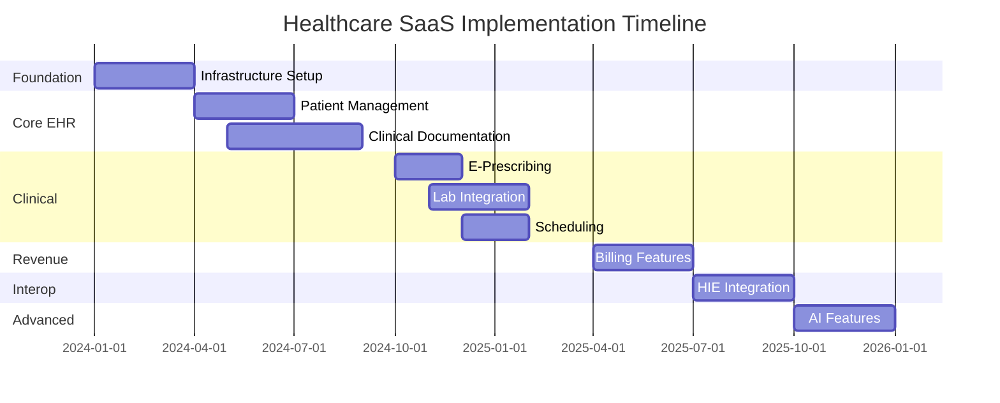

# Healthcare Systems SaaS Transformation Plan

## Executive Summary
This document outlines the comprehensive transformation of Healthcare Systems demo components into a fully functional, HIPAA-compliant SaaS Electronic Health Record (EHR) and Practice Management platform. The platform will serve healthcare providers ranging from solo practitioners to large hospital systems, providing integrated clinical, operational, and financial capabilities.

---

## 1. Product Vision & Scope

### 1.1 Vision Statement
Build a next-generation healthcare platform that seamlessly integrates clinical care delivery, practice management, telehealth, and revenue cycle management while maintaining the highest standards of security, compliance, and usability.

### 1.2 Core Modules

#### EHR/EMR Functionality
- **Clinical Documentation**: SOAP notes, progress notes, discharge summaries
- **Clinical Decision Support**: Drug interaction checking, clinical guidelines, alerts
- **Order Management**: Lab orders, imaging orders, referrals
- **Results Management**: Lab results review, imaging reports, pathology
- **Medication Management**: E-prescribing, medication reconciliation, allergy checking
- **Problem Lists**: Active diagnoses, medical history, surgical history
- **Immunization Records**: Registry integration, forecasting

#### Practice Management
- **Scheduling**: Multi-provider, multi-location appointment management
- **Patient Registration**: Demographics, insurance, consent management
- **Resource Management**: Room allocation, equipment scheduling
- **Workflow Automation**: Task management, internal messaging
- **Document Management**: Scanning, faxing, document routing

#### Telehealth Platform
- **Video Consultations**: HD video, screen sharing, virtual waiting rooms
- **Async Care**: Secure messaging, photo sharing, questionnaires
- **Remote Monitoring**: Device integration, vital signs tracking
- **Digital Check-in**: Pre-visit forms, insurance verification

#### Revenue Cycle Management
- **Eligibility Verification**: Real-time insurance checks
- **Prior Authorization**: Electronic submissions, status tracking
- **Claims Management**: Submission, tracking, denial management
- **Payment Processing**: Patient payments, payment plans
- **Financial Reporting**: A/R aging, productivity, profitability

### 1.3 Target Market Segments
- **Solo Practitioners**: Individual providers
- **Small Practices**: 2-10 providers
- **Medium Practices**: 11-50 providers
- **Large Practices/Clinics**: 50+ providers
- **Hospital Systems**: Multi-facility enterprises
- **Specialty Focus**: Primary care, specialists, urgent care, behavioral health

### 1.4 HIPAA Compliance Framework
- **Administrative Safeguards**: Security officer designation, workforce training, access management
- **Physical Safeguards**: Data center security, workstation policies
- **Technical Safeguards**: Access controls, encryption, audit controls
- **Organizational Requirements**: Business Associate Agreements (BAAs)
- **Breach Notification**: Incident response, notification procedures

---

## 2. Database Architecture

### 2.1 Multi-Tenant Architecture

#### Tenant Isolation Strategy
```sql
-- Hybrid approach: Shared database with row-level security
-- Each table includes org_id for tenant isolation
-- PostgreSQL RLS policies enforce isolation

CREATE POLICY tenant_isolation ON patients
    USING (org_id = current_setting('app.current_org_id')::uuid);
```

### 2.2 Core Data Models

#### Organizations & Tenants
```sql
-- Multi-tenant organization structure
CREATE TABLE organizations (
    id UUID PRIMARY KEY DEFAULT gen_random_uuid(),
    name VARCHAR(255) NOT NULL,
    type VARCHAR(50), -- hospital, clinic, practice
    tax_id VARCHAR(20),
    npi VARCHAR(10),
    subscription_tier VARCHAR(50),
    settings JSONB,
    created_at TIMESTAMP DEFAULT CURRENT_TIMESTAMP,
    updated_at TIMESTAMP DEFAULT CURRENT_TIMESTAMP
);

-- Facilities within organizations
CREATE TABLE facilities (
    id UUID PRIMARY KEY DEFAULT gen_random_uuid(),
    org_id UUID REFERENCES organizations(id),
    name VARCHAR(255) NOT NULL,
    address JSONB,
    phone VARCHAR(20),
    fax VARCHAR(20),
    place_of_service_code VARCHAR(2)
);
```

#### Patient Records
```sql
-- Core patient demographics
CREATE TABLE patients (
    id UUID PRIMARY KEY DEFAULT gen_random_uuid(),
    org_id UUID REFERENCES organizations(id),
    mrn VARCHAR(50) NOT NULL, -- Medical Record Number
    first_name VARCHAR(100) NOT NULL,
    last_name VARCHAR(100) NOT NULL,
    middle_name VARCHAR(100),
    date_of_birth DATE NOT NULL,
    sex VARCHAR(10),
    gender_identity VARCHAR(50),
    ssn_encrypted VARCHAR(255), -- Encrypted SSN
    email VARCHAR(255),
    phone VARCHAR(20),
    address JSONB,
    emergency_contact JSONB,
    preferred_language VARCHAR(10),
    race VARCHAR(50),
    ethnicity VARCHAR(50),
    created_at TIMESTAMP DEFAULT CURRENT_TIMESTAMP,
    updated_at TIMESTAMP DEFAULT CURRENT_TIMESTAMP,
    deleted_at TIMESTAMP, -- Soft delete
    UNIQUE(org_id, mrn)
);

-- Patient insurance information
CREATE TABLE insurance_policies (
    id UUID PRIMARY KEY DEFAULT gen_random_uuid(),
    patient_id UUID REFERENCES patients(id),
    payer_id UUID REFERENCES payers(id),
    policy_number VARCHAR(50),
    group_number VARCHAR(50),
    subscriber_name VARCHAR(255),
    subscriber_relationship VARCHAR(50),
    effective_date DATE,
    termination_date DATE,
    copay_amount DECIMAL(10,2),
    deductible_amount DECIMAL(10,2),
    is_primary BOOLEAN DEFAULT true
);
```

#### Clinical Records
```sql
-- Encounters (visits, admissions)
CREATE TABLE encounters (
    id UUID PRIMARY KEY DEFAULT gen_random_uuid(),
    org_id UUID REFERENCES organizations(id),
    patient_id UUID REFERENCES patients(id),
    provider_id UUID REFERENCES providers(id),
    facility_id UUID REFERENCES facilities(id),
    encounter_type VARCHAR(50), -- office_visit, hospital_admission, telehealth
    status VARCHAR(50), -- scheduled, checked_in, in_progress, completed
    start_datetime TIMESTAMP,
    end_datetime TIMESTAMP,
    chief_complaint TEXT,
    visit_reason VARCHAR(255),
    created_at TIMESTAMP DEFAULT CURRENT_TIMESTAMP
);

-- Clinical notes
CREATE TABLE clinical_notes (
    id UUID PRIMARY KEY DEFAULT gen_random_uuid(),
    encounter_id UUID REFERENCES encounters(id),
    provider_id UUID REFERENCES providers(id),
    note_type VARCHAR(50), -- soap, progress, discharge, consult
    content JSONB, -- Structured SOAP note
    signed_at TIMESTAMP,
    signed_by UUID REFERENCES providers(id),
    addendum TEXT,
    created_at TIMESTAMP DEFAULT CURRENT_TIMESTAMP,
    updated_at TIMESTAMP DEFAULT CURRENT_TIMESTAMP
);

-- Diagnoses
CREATE TABLE diagnoses (
    id UUID PRIMARY KEY DEFAULT gen_random_uuid(),
    patient_id UUID REFERENCES patients(id),
    encounter_id UUID REFERENCES encounters(id),
    icd10_code VARCHAR(10) NOT NULL,
    description TEXT,
    type VARCHAR(20), -- primary, secondary, admitting
    status VARCHAR(20), -- active, resolved, chronic
    onset_date DATE,
    resolved_date DATE,
    created_by UUID REFERENCES providers(id),
    created_at TIMESTAMP DEFAULT CURRENT_TIMESTAMP
);

-- Medications
CREATE TABLE medications (
    id UUID PRIMARY KEY DEFAULT gen_random_uuid(),
    patient_id UUID REFERENCES patients(id),
    encounter_id UUID REFERENCES encounters(id),
    medication_name VARCHAR(255),
    rxcui VARCHAR(20), -- RxNorm Concept Unique Identifier
    dosage VARCHAR(100),
    frequency VARCHAR(100),
    route VARCHAR(50),
    start_date DATE,
    end_date DATE,
    prescriber_id UUID REFERENCES providers(id),
    pharmacy_id UUID REFERENCES pharmacies(id),
    status VARCHAR(20), -- active, discontinued, completed
    created_at TIMESTAMP DEFAULT CURRENT_TIMESTAMP
);

-- Allergies
CREATE TABLE allergies (
    id UUID PRIMARY KEY DEFAULT gen_random_uuid(),
    patient_id UUID REFERENCES patients(id),
    allergen VARCHAR(255),
    reaction VARCHAR(255),
    severity VARCHAR(20), -- mild, moderate, severe
    onset_date DATE,
    status VARCHAR(20), -- active, inactive, resolved
    created_at TIMESTAMP DEFAULT CURRENT_TIMESTAMP
);
```

#### Lab & Imaging
```sql
-- Lab orders
CREATE TABLE lab_orders (
    id UUID PRIMARY KEY DEFAULT gen_random_uuid(),
    patient_id UUID REFERENCES patients(id),
    encounter_id UUID REFERENCES encounters(id),
    ordering_provider_id UUID REFERENCES providers(id),
    lab_id UUID REFERENCES labs(id),
    order_date TIMESTAMP,
    status VARCHAR(50), -- pending, in_progress, completed, cancelled
    priority VARCHAR(20), -- routine, urgent, stat
    tests JSONB, -- Array of test codes and names
    specimen_collected_at TIMESTAMP,
    created_at TIMESTAMP DEFAULT CURRENT_TIMESTAMP
);

-- Lab results
CREATE TABLE lab_results (
    id UUID PRIMARY KEY DEFAULT gen_random_uuid(),
    lab_order_id UUID REFERENCES lab_orders(id),
    test_code VARCHAR(20),
    test_name VARCHAR(255),
    result_value VARCHAR(255),
    unit VARCHAR(50),
    reference_range VARCHAR(100),
    abnormal_flag VARCHAR(10), -- L, H, LL, HH, N
    status VARCHAR(20), -- preliminary, final, corrected
    resulted_at TIMESTAMP,
    reviewed_by UUID REFERENCES providers(id),
    reviewed_at TIMESTAMP
);
```

#### Appointments
```sql
-- Appointment scheduling
CREATE TABLE appointments (
    id UUID PRIMARY KEY DEFAULT gen_random_uuid(),
    org_id UUID REFERENCES organizations(id),
    patient_id UUID REFERENCES patients(id),
    provider_id UUID REFERENCES providers(id),
    facility_id UUID REFERENCES facilities(id),
    appointment_type_id UUID REFERENCES appointment_types(id),
    start_datetime TIMESTAMP NOT NULL,
    duration_minutes INTEGER NOT NULL,
    status VARCHAR(50), -- scheduled, confirmed, checked_in, completed, no_show, cancelled
    reason TEXT,
    notes TEXT,
    reminder_sent BOOLEAN DEFAULT false,
    created_at TIMESTAMP DEFAULT CURRENT_TIMESTAMP,
    updated_at TIMESTAMP DEFAULT CURRENT_TIMESTAMP
);
```

#### Billing & Revenue
```sql
-- Claims
CREATE TABLE claims (
    id UUID PRIMARY KEY DEFAULT gen_random_uuid(),
    org_id UUID REFERENCES organizations(id),
    patient_id UUID REFERENCES patients(id),
    encounter_id UUID REFERENCES encounters(id),
    payer_id UUID REFERENCES payers(id),
    claim_number VARCHAR(50) UNIQUE,
    status VARCHAR(50), -- draft, submitted, accepted, rejected, paid
    total_charge DECIMAL(10,2),
    allowed_amount DECIMAL(10,2),
    paid_amount DECIMAL(10,2),
    patient_responsibility DECIMAL(10,2),
    submitted_at TIMESTAMP,
    paid_at TIMESTAMP,
    service_lines JSONB, -- CPT codes, modifiers, charges
    created_at TIMESTAMP DEFAULT CURRENT_TIMESTAMP
);

-- Payments
CREATE TABLE payments (
    id UUID PRIMARY KEY DEFAULT gen_random_uuid(),
    claim_id UUID REFERENCES claims(id),
    patient_id UUID REFERENCES patients(id),
    amount DECIMAL(10,2),
    payment_method VARCHAR(50), -- check, credit_card, ach, cash
    reference_number VARCHAR(100),
    payment_date DATE,
    posted_date DATE,
    created_at TIMESTAMP DEFAULT CURRENT_TIMESTAMP
);
```

### 2.3 Audit & Compliance
```sql
-- HIPAA-required audit log
CREATE TABLE audit_logs (
    id UUID PRIMARY KEY DEFAULT gen_random_uuid(),
    org_id UUID,
    user_id UUID,
    patient_id UUID,
    action VARCHAR(50), -- view, create, update, delete, print, export
    resource_type VARCHAR(50), -- patient, encounter, medication, etc.
    resource_id UUID,
    ip_address INET,
    user_agent TEXT,
    success BOOLEAN,
    failure_reason TEXT,
    created_at TIMESTAMP DEFAULT CURRENT_TIMESTAMP
);

-- Create index for efficient querying
CREATE INDEX idx_audit_logs_patient_id ON audit_logs(patient_id);
CREATE INDEX idx_audit_logs_created_at ON audit_logs(created_at);
```

### 2.4 Data Security Measures
- **Encryption at Rest**: AES-256 encryption for all database files
- **Encryption in Transit**: TLS 1.3 for all connections
- **Field-Level Encryption**: SSN, credit cards, other PII
- **Data Masking**: For non-production environments
- **Backup Strategy**: Daily encrypted backups, 7-year retention
- **Disaster Recovery**: Multi-region replication, RPO < 1 hour, RTO < 4 hours

---

## 3. Authentication & Authorization

### 3.1 User Roles & Permissions

#### Role Hierarchy
```yaml
roles:
  super_admin:
    description: "System-level administrator"
    permissions:
      - system.*
      - organization.manage
      - audit.view_all

  org_admin:
    description: "Organization administrator"
    permissions:
      - organization.settings
      - users.manage
      - billing.manage
      - reports.financial

  medical_director:
    description: "Clinical oversight"
    permissions:
      - patients.view_all
      - clinical.protocols
      - quality.metrics
      - provider.schedules

  attending_physician:
    description: "Primary care provider"
    permissions:
      - patients.full_access
      - orders.create
      - prescriptions.create
      - notes.create_sign

  resident_physician:
    description: "Physician in training"
    permissions:
      - patients.view_assigned
      - notes.create
      - orders.create_requires_cosign

  nurse_practitioner:
    description: "Advanced practice nurse"
    permissions:
      - patients.full_access
      - prescriptions.create_limited
      - orders.create
      - notes.create_sign

  registered_nurse:
    description: "Nursing staff"
    permissions:
      - patients.view_assigned
      - vitals.create
      - medications.administer
      - notes.create_nursing

  medical_assistant:
    description: "Clinical support staff"
    permissions:
      - patients.view_basic
      - vitals.create
      - appointments.manage
      - messages.triage

  front_desk:
    description: "Reception staff"
    permissions:
      - patients.demographics
      - appointments.manage
      - insurance.verify
      - copay.collect

  billing_staff:
    description: "Revenue cycle staff"
    permissions:
      - claims.manage
      - payments.post
      - reports.financial
      - insurance.manage

  patient:
    description: "Patient portal access"
    permissions:
      - own_record.view
      - appointments.request
      - messages.send
      - bills.pay
```

### 3.2 Authentication Implementation

#### Multi-Factor Authentication
```typescript
// Auth service with MFA
interface AuthService {
  // Primary authentication
  async login(credentials: Credentials): Promise<AuthSession>;

  // MFA verification
  async verifyMFA(sessionId: string, code: string): Promise<AuthToken>;

  // Session management
  async refreshToken(refreshToken: string): Promise<AuthToken>;
  async logout(sessionId: string): Promise<void>;

  // Password management
  async resetPassword(email: string): Promise<void>;
  async changePassword(oldPass: string, newPass: string): Promise<void>;
}

// MFA methods supported
enum MFAMethod {
  SMS = 'sms',
  TOTP = 'totp', // Google Authenticator
  EMAIL = 'email',
  BIOMETRIC = 'biometric' // For mobile apps
}
```

#### Session Management
```typescript
interface SessionConfig {
  maxIdleTime: 15 * 60 * 1000; // 15 minutes
  maxSessionTime: 12 * 60 * 60 * 1000; // 12 hours
  requireReauthFor: ['prescriptions', 'billing', 'phi_export'];
  concurrentSessions: false; // Single session per user
}
```

### 3.3 Authorization Implementation

#### Attribute-Based Access Control (ABAC)
```typescript
// Context-aware authorization
interface AuthorizationContext {
  user: User;
  resource: Resource;
  action: Action;
  environment: {
    ipAddress: string;
    time: Date;
    location?: string;
    deviceTrust: boolean;
  };
}

class AuthorizationService {
  async authorize(context: AuthorizationContext): Promise<boolean> {
    // Check role-based permissions
    const rolePermissions = await this.getRolePermissions(context.user.role);

    // Check attribute-based rules
    const attributeRules = await this.getAttributeRules(context);

    // Check organization context
    const orgContext = await this.validateOrgContext(context);

    // Audit the access attempt
    await this.auditAccess(context);

    return rolePermissions && attributeRules && orgContext;
  }
}
```

### 3.4 Patient Portal Security

#### Identity Verification
```typescript
interface PatientVerification {
  // Initial verification
  verifyIdentity(data: {
    ssn: string;
    dob: Date;
    zip: string;
  }): Promise<boolean>;

  // Knowledge-based authentication
  askSecurityQuestions(): Promise<SecurityQuestion[]>;

  // Document verification
  verifyDocument(type: 'drivers_license' | 'insurance_card'): Promise<boolean>;
}
```

### 3.5 Audit Trail Implementation
```typescript
class AuditLogger {
  async logAccess(event: {
    userId: string;
    patientId?: string;
    action: string;
    resource: string;
    result: 'success' | 'denied';
    metadata?: any;
  }): Promise<void> {
    await db.auditLogs.create({
      ...event,
      timestamp: new Date(),
      ipAddress: getClientIP(),
      sessionId: getCurrentSession(),
      userAgent: getUserAgent()
    });

    // Real-time alerting for suspicious activity
    if (this.isSuspicious(event)) {
      await this.alertSecurityTeam(event);
    }
  }
}
```

---

## 4. API Design

### 4.1 REST API Structure

#### Base URL Structure
```
https://api.healthcaresys.com/v1/
https://api.healthcaresys.com/fhir/r4/  # FHIR endpoints
```

### 4.2 Core API Endpoints

#### Patient Management
```typescript
// Patient CRUD operations
GET    /api/v1/patients                 // List patients (paginated)
GET    /api/v1/patients/:id            // Get patient details
POST   /api/v1/patients                // Create patient
PUT    /api/v1/patients/:id            // Update patient
DELETE /api/v1/patients/:id            // Soft delete patient

// Patient search
GET    /api/v1/patients/search         // Advanced search
  ?name=John+Doe
  &dob=1980-01-01
  &mrn=12345
  &ssn_last4=1234

// Patient documents
GET    /api/v1/patients/:id/documents
POST   /api/v1/patients/:id/documents
```

#### Clinical Documentation
```typescript
// Encounters
GET    /api/v1/encounters              // List encounters
POST   /api/v1/encounters              // Create encounter
GET    /api/v1/encounters/:id          // Get encounter details
PUT    /api/v1/encounters/:id          // Update encounter

// Clinical notes
POST   /api/v1/encounters/:id/notes    // Add clinical note
GET    /api/v1/encounters/:id/notes    // Get notes for encounter
PUT    /api/v1/notes/:id               // Update note
POST   /api/v1/notes/:id/sign          // Sign note
POST   /api/v1/notes/:id/addendum      // Add addendum

// SOAP note structure
{
  "type": "soap",
  "content": {
    "subjective": "Patient reports...",
    "objective": "Vital signs: ...",
    "assessment": "Diagnosis: ...",
    "plan": "Treatment plan: ..."
  }
}
```

#### Orders & Results
```typescript
// Lab orders
POST   /api/v1/orders/lab              // Create lab order
GET    /api/v1/orders/lab/:id          // Get lab order
PUT    /api/v1/orders/lab/:id/cancel   // Cancel order

// Lab results
GET    /api/v1/results/lab             // List lab results
GET    /api/v1/results/lab/:id         // Get specific result
POST   /api/v1/results/lab/:id/review  // Mark as reviewed

// Imaging orders
POST   /api/v1/orders/imaging          // Create imaging order
GET    /api/v1/orders/imaging/:id      // Get imaging order
```

#### Prescriptions
```typescript
// E-prescribing
POST   /api/v1/prescriptions           // Create prescription
GET    /api/v1/prescriptions/:id       // Get prescription
POST   /api/v1/prescriptions/:id/send  // Send to pharmacy
POST   /api/v1/prescriptions/:id/cancel // Cancel prescription

// Drug interaction checking
POST   /api/v1/prescriptions/check-interactions
{
  "medications": ["rxcui1", "rxcui2"],
  "allergies": ["penicillin"]
}

// Prior authorization
POST   /api/v1/prescriptions/:id/prior-auth
GET    /api/v1/prescriptions/:id/prior-auth/status
```

#### Scheduling
```typescript
// Appointments
GET    /api/v1/appointments            // List appointments
POST   /api/v1/appointments            // Create appointment
PUT    /api/v1/appointments/:id        // Update appointment
DELETE /api/v1/appointments/:id        // Cancel appointment

// Availability
GET    /api/v1/providers/:id/availability
  ?date=2024-01-15
  &duration=30

// Waitlist
POST   /api/v1/waitlist                // Add to waitlist
GET    /api/v1/waitlist                // Get waitlist
```

#### Billing & Insurance
```typescript
// Insurance eligibility
POST   /api/v1/insurance/verify        // Verify eligibility
{
  "payerId": "BCBS",
  "memberId": "123456789",
  "serviceDate": "2024-01-15"
}

// Claims
POST   /api/v1/claims                  // Submit claim
GET    /api/v1/claims/:id              // Get claim status
PUT    /api/v1/claims/:id              // Update claim
POST   /api/v1/claims/:id/resubmit     // Resubmit claim

// Payments
POST   /api/v1/payments                // Post payment
GET    /api/v1/payments                // List payments
```

### 4.3 FHIR API Implementation

#### FHIR Resources
```typescript
// Patient resource
GET    /fhir/r4/Patient/:id
POST   /fhir/r4/Patient
PUT    /fhir/r4/Patient/:id

// Encounter resource
GET    /fhir/r4/Encounter/:id
POST   /fhir/r4/Encounter

// Observation resource (lab results, vitals)
GET    /fhir/r4/Observation
POST   /fhir/r4/Observation

// MedicationRequest resource
GET    /fhir/r4/MedicationRequest
POST   /fhir/r4/MedicationRequest

// Bundle operations for batch
POST   /fhir/r4/Bundle
```

### 4.4 GraphQL API (Alternative)
```graphql
type Query {
  patient(id: ID!): Patient
  patients(filter: PatientFilter, pagination: Pagination): PatientConnection
  encounter(id: ID!): Encounter
  appointments(date: Date!, providerId: ID): [Appointment]
}

type Mutation {
  createPatient(input: PatientInput!): Patient
  updatePatient(id: ID!, input: PatientInput!): Patient
  createEncounter(input: EncounterInput!): Encounter
  signNote(noteId: ID!): ClinicalNote
  prescribeMedication(input: PrescriptionInput!): Prescription
}

type Subscription {
  labResultReady(patientId: ID!): LabResult
  appointmentStatusChanged(appointmentId: ID!): Appointment
}
```

### 4.5 WebSocket Events
```typescript
// Real-time events
interface RealtimeEvents {
  // Clinical alerts
  'critical-lab-result': LabResult;
  'allergy-alert': AllergyAlert;
  'drug-interaction': DrugInteraction;

  // Operational events
  'patient-checked-in': Patient;
  'appointment-cancelled': Appointment;
  'new-message': Message;

  // System events
  'maintenance-scheduled': MaintenanceNotice;
  'integration-error': IntegrationError;
}
```

---

## 5. Frontend Architecture

### 5.1 Application Structure

#### Provider Portal (Web Application)
```typescript
// Tech stack
- Framework: Next.js 14 with App Router
- UI Library: React 18
- State Management: Zustand + React Query
- Styling: Tailwind CSS + Shadcn/ui
- Forms: React Hook Form + Zod
- Real-time: Socket.io
- Charts: Recharts
- PDF Generation: React PDF

// Folder structure
src/
├── app/                      # Next.js app router
│   ├── (auth)/              # Auth pages
│   ├── (dashboard)/         # Main application
│   │   ├── patients/
│   │   ├── encounters/
│   │   ├── scheduling/
│   │   ├── prescriptions/
│   │   ├── billing/
│   │   └── reports/
│   └── api/                 # API routes
├── components/
│   ├── clinical/            # Clinical components
│   ├── scheduling/          # Scheduling components
│   ├── billing/            # Billing components
│   └── shared/             # Shared components
├── hooks/                   # Custom hooks
├── lib/                     # Utilities
├── services/               # API services
└── types/                  # TypeScript types
```

#### Patient Portal (Responsive Web)
```typescript
// Simplified stack for patients
- Framework: Next.js
- UI: Tailwind + Headless UI
- Auth: NextAuth.js
- Payments: Stripe Elements

// Key features
- Appointment booking
- Medical records access
- Secure messaging
- Bill pay
- Prescription refills
- Telehealth visits
```

#### Mobile Applications
```typescript
// Provider mobile app
- Framework: React Native + Expo
- Navigation: React Navigation
- State: Redux Toolkit
- Offline: WatermelonDB
- Push: Expo Notifications

// Features
- Patient list management
- Quick charting
- E-prescribing
- Secure messaging
- On-call scheduling
```

### 5.2 Component Architecture

#### Clinical Components
```typescript
// Patient chart component
interface PatientChartProps {
  patientId: string;
  encounterId?: string;
}

const PatientChart: React.FC<PatientChartProps> = ({ patientId, encounterId }) => {
  return (
    <div className="patient-chart">
      <PatientHeader patientId={patientId} />
      <ChartNavigation />
      <div className="chart-content">
        <Routes>
          <Route path="demographics" element={<Demographics />} />
          <Route path="encounters" element={<EncounterList />} />
          <Route path="medications" element={<MedicationList />} />
          <Route path="allergies" element={<AllergyList />} />
          <Route path="labs" element={<LabResults />} />
          <Route path="documents" element={<Documents />} />
        </Routes>
      </div>
    </div>
  );
};

// SOAP note editor
const SOAPNoteEditor: React.FC = () => {
  const { register, handleSubmit, watch } = useForm<SOAPNote>();
  const [templates, setTemplates] = useState<Template[]>([]);

  return (
    <form onSubmit={handleSubmit(onSubmit)}>
      <div className="soap-sections">
        <Section title="Subjective">
          <RichTextEditor {...register('subjective')} />
          <VoiceToText onTranscribe={setText} />
        </Section>

        <Section title="Objective">
          <VitalSigns />
          <PhysicalExam />
          <RichTextEditor {...register('objective')} />
        </Section>

        <Section title="Assessment">
          <DiagnosisSelector />
          <RichTextEditor {...register('assessment')} />
        </Section>

        <Section title="Plan">
          <OrdersBuilder />
          <PrescriptionBuilder />
          <RichTextEditor {...register('plan')} />
        </Section>
      </div>

      <div className="actions">
        <Button variant="outline" onClick={saveDraft}>Save Draft</Button>
        <Button variant="primary" type="submit">Sign Note</Button>
      </div>
    </form>
  );
};
```

#### Telehealth Components
```typescript
// Video consultation room
const VideoConsultation: React.FC = () => {
  const [localStream, setLocalStream] = useState<MediaStream>();
  const [remoteStream, setRemoteStream] = useState<MediaStream>();
  const [isScreenSharing, setIsScreenSharing] = useState(false);

  return (
    <div className="video-consultation">
      <div className="video-grid">
        <VideoTile stream={remoteStream} label="Patient" main />
        <VideoTile stream={localStream} label="You" pip />
      </div>

      <ControlBar>
        <MuteButton />
        <VideoToggle />
        <ScreenShareButton />
        <RecordButton />
        <EndCallButton />
      </ControlBar>

      <Sidebar>
        <PatientInfo />
        <QuickChart />
        <SecureChat />
        <DocumentShare />
      </Sidebar>
    </div>
  );
};
```

### 5.3 State Management
```typescript
// Global state with Zustand
interface AppState {
  // User context
  currentUser: User | null;
  currentOrganization: Organization | null;

  // Patient context
  selectedPatient: Patient | null;
  currentEncounter: Encounter | null;

  // UI state
  sidebarOpen: boolean;
  activeModule: string;

  // Actions
  setCurrentUser: (user: User) => void;
  selectPatient: (patient: Patient) => void;
  startEncounter: (encounter: Encounter) => void;
}

// API state with React Query
const usePatient = (patientId: string) => {
  return useQuery({
    queryKey: ['patient', patientId],
    queryFn: () => fetchPatient(patientId),
    staleTime: 5 * 60 * 1000, // 5 minutes
  });
};

// Real-time subscriptions
const useRealtimeUpdates = () => {
  useEffect(() => {
    const socket = io(SOCKET_URL);

    socket.on('lab-result-ready', handleLabResult);
    socket.on('appointment-update', handleAppointmentUpdate);

    return () => socket.disconnect();
  }, []);
};
```

### 5.4 Performance Optimization
```typescript
// Code splitting
const BillingModule = lazy(() => import('./modules/Billing'));
const ReportsModule = lazy(() => import('./modules/Reports'));

// Virtual scrolling for large lists
const PatientList: React.FC = () => {
  return (
    <VirtualList
      height={600}
      itemCount={patients.length}
      itemSize={80}
      renderItem={({ index, style }) => (
        <PatientRow patient={patients[index]} style={style} />
      )}
    />
  );
};

// Optimistic updates
const useUpdatePatient = () => {
  const queryClient = useQueryClient();

  return useMutation({
    mutationFn: updatePatient,
    onMutate: async (newPatient) => {
      await queryClient.cancelQueries(['patient', newPatient.id]);
      const previousPatient = queryClient.getQueryData(['patient', newPatient.id]);
      queryClient.setQueryData(['patient', newPatient.id], newPatient);
      return { previousPatient };
    },
    onError: (err, newPatient, context) => {
      queryClient.setQueryData(['patient', newPatient.id], context.previousPatient);
    },
  });
};
```

---

## 6. Backend Services

### 6.1 Microservices Architecture

#### Service Breakdown
```yaml
services:
  api-gateway:
    description: "Central API gateway"
    tech: "Kong/Express Gateway"
    responsibilities:
      - Authentication
      - Rate limiting
      - Request routing
      - API versioning

  auth-service:
    description: "Authentication & authorization"
    tech: "Node.js + Passport"
    responsibilities:
      - User authentication
      - Token management
      - Role management
      - MFA handling

  clinical-service:
    description: "Clinical data management"
    tech: "Node.js + TypeScript"
    responsibilities:
      - Patient records
      - Encounters
      - Clinical notes
      - Lab/imaging

  scheduling-service:
    description: "Appointment management"
    tech: "Node.js + Bull"
    responsibilities:
      - Appointment CRUD
      - Availability management
      - Reminders
      - Waitlist

  billing-service:
    description: "Revenue cycle management"
    tech: "Python + FastAPI"
    responsibilities:
      - Claims processing
      - Payment posting
      - Eligibility verification
      - Reporting

  notification-service:
    description: "Communications hub"
    tech: "Node.js + Bull"
    integrations:
      - Twilio (SMS)
      - SendGrid (Email)
      - FCM (Push)

  integration-service:
    description: "External integrations"
    tech: "Node.js + Mirth"
    responsibilities:
      - HL7 processing
      - FHIR translation
      - Lab interfaces
      - Pharmacy connections

  telehealth-service:
    description: "Video consultation platform"
    tech: "Node.js + WebRTC"
    integrations:
      - Twilio Video
      - Daily.co
      - Agora

  analytics-service:
    description: "Reporting & analytics"
    tech: "Python + Apache Spark"
    responsibilities:
      - Quality metrics
      - Financial reports
      - Population health
      - Predictive analytics
```

### 6.2 Notification Service Implementation
```typescript
class NotificationService {
  private twilioClient: Twilio;
  private sendgridClient: SendGrid;
  private fcmClient: FCM;

  async sendAppointmentReminder(appointment: Appointment) {
    const patient = await this.getPatient(appointment.patientId);
    const template = await this.getTemplate('appointment-reminder');

    // Send based on patient preferences
    if (patient.preferences.sms) {
      await this.sendSMS(patient.phone, template.sms(appointment));
    }

    if (patient.preferences.email) {
      await this.sendEmail(patient.email, template.email(appointment));
    }

    if (patient.preferences.push) {
      await this.sendPush(patient.deviceTokens, template.push(appointment));
    }

    // Log notification
    await this.logNotification({
      type: 'appointment-reminder',
      patientId: patient.id,
      appointmentId: appointment.id,
      channels: ['sms', 'email', 'push'],
      sentAt: new Date()
    });
  }

  async sendCriticalLabAlert(result: LabResult) {
    const provider = await this.getProvider(result.orderingProviderId);

    // Critical results require immediate notification
    await Promise.all([
      this.sendSMS(provider.phone, `CRITICAL LAB: ${result.summary}`),
      this.sendPush(provider.deviceTokens, {
        title: 'Critical Lab Result',
        body: result.summary,
        priority: 'high',
        data: { resultId: result.id }
      }),
      this.createInAppAlert(provider.id, result)
    ]);
  }
}
```

### 6.3 Insurance Verification Service
```typescript
class InsuranceVerificationService {
  private availityClient: AvailityClient;
  private changeHealthcareClient: ChangeHealthcareClient;

  async verifyEligibility(request: EligibilityRequest): Promise<EligibilityResponse> {
    try {
      // Route to appropriate clearinghouse
      const clearinghouse = this.selectClearinghouse(request.payerId);

      // Build X12 270 transaction
      const x12Transaction = this.buildX12_270(request);

      // Submit eligibility request
      const response = await clearinghouse.submitEligibility(x12Transaction);

      // Parse X12 271 response
      const eligibility = this.parseX12_271(response);

      // Cache result
      await this.cacheEligibility(request.patientId, eligibility);

      // Return structured response
      return {
        eligible: eligibility.isEligible,
        copay: eligibility.copay,
        deductible: eligibility.deductible,
        deductibleMet: eligibility.deductibleMet,
        outOfPocketMax: eligibility.outOfPocketMax,
        outOfPocketMet: eligibility.outOfPocketMet,
        coverageDetails: eligibility.benefits,
        verifiedAt: new Date()
      };
    } catch (error) {
      // Fallback to manual verification
      await this.queueManualVerification(request);
      throw new InsuranceVerificationError(error);
    }
  }

  async submitPriorAuthorization(request: PriorAuthRequest): Promise<PriorAuthResponse> {
    // Build authorization request
    const authRequest = {
      patient: request.patient,
      provider: request.provider,
      service: request.service,
      clinicalDocumentation: request.documentation,
      icd10Codes: request.diagnoses,
      cptCodes: request.procedures
    };

    // Submit to payer
    const response = await this.submitToPayer(authRequest);

    // Track authorization status
    await this.trackAuthorization({
      authNumber: response.authorizationNumber,
      status: response.status,
      expirationDate: response.expirationDate
    });

    return response;
  }
}
```

### 6.4 E-Prescribing Service
```typescript
class EPrescribingService {
  private surescriptsClient: SurescriptsClient;
  private drugDatabase: DrugDatabase;

  async createPrescription(rx: PrescriptionRequest): Promise<Prescription> {
    // Drug interaction checking
    const interactions = await this.checkDrugInteractions(rx);
    if (interactions.severe.length > 0) {
      throw new DrugInteractionError(interactions.severe);
    }

    // Formulary checking
    const formularyStatus = await this.checkFormulary(
      rx.medication,
      rx.patient.insuranceId
    );

    // Controlled substance compliance
    if (rx.medication.schedule) {
      await this.validateControlledSubstance(rx);
      await this.checkPDMP(rx.patient, rx.medication);
    }

    // Build NCPDP SCRIPT message
    const scriptMessage = this.buildNCPDPScript(rx);

    // Send to pharmacy
    const response = await this.surescriptsClient.sendPrescription(
      scriptMessage,
      rx.pharmacyId
    );

    // Log prescription
    await this.logPrescription({
      ...rx,
      sentAt: new Date(),
      messageId: response.messageId,
      status: 'sent'
    });

    return response;
  }

  async checkDrugInteractions(rx: PrescriptionRequest): Promise<InteractionCheck> {
    const patientMedications = await this.getActiveMedications(rx.patient.id);
    const allergies = await this.getAllergies(rx.patient.id);

    return this.drugDatabase.checkInteractions({
      newMedication: rx.medication,
      currentMedications: patientMedications,
      allergies: allergies,
      conditions: rx.patient.conditions
    });
  }
}
```

### 6.5 Lab Integration Service
```typescript
class LabIntegrationService {
  private hl7Parser: HL7Parser;
  private labInterfaces: Map<string, LabInterface>;

  async processLabOrder(order: LabOrder): Promise<void> {
    // Generate ORM (Order Message) HL7 message
    const ormMessage = this.buildORMMessage(order);

    // Send to lab system
    const labInterface = this.labInterfaces.get(order.labId);
    await labInterface.sendOrder(ormMessage);

    // Update order status
    await this.updateOrderStatus(order.id, 'transmitted');
  }

  async processLabResult(hl7Message: string): Promise<void> {
    // Parse ORU (Observation Result) message
    const result = this.hl7Parser.parseORU(hl7Message);

    // Match to original order
    const order = await this.matchOrder(result.orderNumber);

    // Store results
    const labResult = await this.storeLabResult({
      orderId: order.id,
      patientId: order.patientId,
      results: result.observations,
      performedAt: result.observationDateTime,
      status: result.status
    });

    // Check for critical values
    if (this.isCritical(labResult)) {
      await this.notificationService.sendCriticalLabAlert(labResult);
    }

    // Send ACK
    await this.sendAcknowledgment(result.messageControlId);
  }
}
```

### 6.6 Document Management Service
```typescript
class DocumentManagementService {
  private s3Client: S3;
  private ocrService: OCRService;

  async uploadDocument(file: File, metadata: DocumentMetadata): Promise<Document> {
    // Scan for malware
    await this.scanFile(file);

    // Generate unique document ID
    const documentId = uuid();

    // Encrypt document
    const encryptedFile = await this.encryptFile(file);

    // Upload to S3
    const s3Key = `${metadata.orgId}/${metadata.patientId}/${documentId}`;
    await this.s3Client.putObject({
      Bucket: process.env.DOCUMENT_BUCKET,
      Key: s3Key,
      Body: encryptedFile,
      ServerSideEncryption: 'aws:kms',
      Metadata: metadata
    });

    // OCR if applicable
    if (this.requiresOCR(file.type)) {
      const text = await this.ocrService.extractText(file);
      await this.indexDocument(documentId, text);
    }

    // Create database record
    return await this.createDocumentRecord({
      id: documentId,
      ...metadata,
      s3Key,
      uploadedAt: new Date()
    });
  }

  async handleIncomingFax(fax: IncomingFax): Promise<void> {
    // Convert fax to PDF
    const pdf = await this.convertToPDF(fax.tiffData);

    // Attempt to auto-route
    const routing = await this.autoRoute(pdf);

    if (routing.patientId) {
      // Attach to patient record
      await this.uploadDocument(pdf, {
        patientId: routing.patientId,
        type: 'fax',
        source: fax.fromNumber,
        category: routing.category
      });
    } else {
      // Queue for manual review
      await this.queueForReview(pdf, fax);
    }
  }
}
```

---

## 7. Technical Stack Recommendations

### 7.1 Infrastructure Stack

#### Cloud Provider
```yaml
Primary: AWS with HIPAA BAA
  Services:
    - EC2/ECS: Application hosting
    - RDS: PostgreSQL database
    - S3: Document storage
    - ElastiCache: Redis caching
    - CloudFront: CDN
    - Route53: DNS
    - VPC: Network isolation
    - KMS: Key management
    - CloudWatch: Monitoring
    - Lambda: Serverless functions
    - SQS/SNS: Message queuing

Alternative: Azure or GCP with BAA
```

#### Database Stack
```yaml
Primary Database: PostgreSQL 15+
  Extensions:
    - pgcrypto: Encryption
    - pg_audit: Audit logging
    - pg_partman: Partitioning
    - TimescaleDB: Time-series data

Cache: Redis 7+
  Use cases:
    - Session storage
    - API caching
    - Rate limiting
    - Real-time features

Document Store: S3 + DynamoDB
  S3: Binary documents (PDFs, images)
  DynamoDB: Document metadata
```

#### Application Stack
```yaml
Backend:
  Language: TypeScript/Node.js 18+
  Framework: NestJS or Express
  ORM: Prisma or TypeORM
  Validation: Joi or Zod
  Testing: Jest + Supertest

Frontend:
  Framework: Next.js 14
  UI: React 18 + Tailwind
  State: Zustand + React Query
  Testing: Jest + React Testing Library

Mobile:
  Framework: React Native + Expo
  State: Redux Toolkit
  Navigation: React Navigation
```

### 7.2 HIPAA-Compliant Infrastructure

#### Security Requirements
```yaml
Network Security:
  - VPC with private subnets
  - Network ACLs and security groups
  - VPN for admin access
  - WAF for application protection

Data Security:
  - Encryption at rest (AES-256)
  - Encryption in transit (TLS 1.3)
  - Key rotation every 90 days
  - Secure key storage (HSM)

Access Control:
  - IAM roles and policies
  - MFA for all admin access
  - Least privilege principle
  - Regular access reviews
```

#### Compliance Tools
```yaml
Monitoring:
  - DataDog or New Relic: APM
  - Splunk or ELK: Log aggregation
  - PagerDuty: Incident management
  - Sentry: Error tracking

Security:
  - Qualys or Rapid7: Vulnerability scanning
  - CrowdStrike or SentinelOne: Endpoint protection
  - Veracode: Application security testing
  - AWS GuardDuty: Threat detection
```

### 7.3 Video Infrastructure

#### Telehealth Platform Options
```yaml
Option 1: Twilio Video
  Pros:
    - HIPAA compliant
    - Good documentation
    - Reliable infrastructure
  Cons:
    - Cost at scale
    - Limited customization

Option 2: Daily.co
  Pros:
    - HIPAA compliant
    - Easy integration
    - Pre-built UI components
  Cons:
    - Less control
    - Vendor lock-in

Option 3: Self-hosted (Jitsi/MediaSoup)
  Pros:
    - Full control
    - Cost effective at scale
    - Customizable
  Cons:
    - Complex setup
    - Maintenance overhead
```

### 7.4 Integration Infrastructure

#### HL7/FHIR Stack
```yaml
Integration Engine: Mirth Connect
  Features:
    - HL7 v2.x support
    - FHIR transformation
    - Channel management
    - Error handling

Alternative: Redox Engine
  Features:
    - Managed service
    - Pre-built integrations
    - Unified API
    - Less maintenance
```

#### External Services
```yaml
E-Prescribing: Surescripts
Eligibility: Availity or Change Healthcare
Lab Integration: LabCorp/Quest APIs
Payments: Stripe Healthcare
SMS: Twilio
Email: SendGrid
Fax: SRFax or Documo
```

---

## 8. Migration Path

### 8.1 Phase 1: Foundation (Months 1-3)

#### Infrastructure Setup
```yaml
Week 1-2:
  - AWS account with BAA
  - VPC and network setup
  - Development environment
  - CI/CD pipeline

Week 3-4:
  - Database setup with encryption
  - Backup and DR configuration
  - Monitoring and alerting
  - Security baseline

Week 5-8:
  - Authentication service
  - Basic user management
  - Audit logging
  - Initial compliance checks

Week 9-12:
  - Core data models
  - API gateway setup
  - Basic frontend scaffolding
  - Testing framework
```

### 8.2 Phase 2: Core EHR (Months 4-9)

#### Essential Features
```yaml
Patient Management:
  - Registration
  - Demographics
  - Insurance
  - Documents

Clinical Documentation:
  - Encounter management
  - SOAP notes
  - Problem lists
  - Medication lists

Basic Workflows:
  - Check-in process
  - Vitals capture
  - Basic charting
  - Note signing
```

### 8.3 Phase 3: Clinical Features (Months 10-15)

#### Advanced Capabilities
```yaml
E-Prescribing:
  - Surescripts integration
  - Drug database
  - Interaction checking
  - PDMP integration

Lab Integration:
  - HL7 interfaces
  - Order management
  - Result processing
  - Critical value alerts

Scheduling:
  - Multi-provider calendars
  - Appointment types
  - Reminders
  - Waitlist management
```

### 8.4 Phase 4: Revenue Cycle (Months 16-18)

#### Billing Features
```yaml
Insurance:
  - Eligibility verification
  - Prior authorization
  - Benefits checking

Claims:
  - Claim generation
  - Electronic submission
  - Denial management
  - Payment posting

Reporting:
  - Financial reports
  - Productivity metrics
  - A/R management
```

### 8.5 Phase 5: Interoperability (Months 19-21)

#### External Connections
```yaml
HIE Integration:
  - Query-based exchange
  - Directed exchange
  - Public health reporting

API Marketplace:
  - Third-party apps
  - Partner integrations
  - Developer portal
```

### 8.6 Phase 6: Advanced Features (Months 22-24)

#### Innovation Layer
```yaml
AI/ML Features:
  - Clinical decision support
  - Predictive analytics
  - Natural language processing
  - Automated coding

Population Health:
  - Risk stratification
  - Care gaps identification
  - Quality measures
  - Outcomes tracking
```

### 8.7 Data Migration Strategy

#### Migration Approach
```yaml
Assessment:
  - Data quality analysis
  - Volume estimation
  - Mapping requirements
  - Compliance review

Preparation:
  - Data cleansing
  - Normalization
  - De-duplication
  - Validation rules

Execution:
  - Pilot migration
  - Incremental approach
  - Parallel run
  - Validation testing

Cutover:
  - Final sync
  - Go-live checklist
  - Rollback plan
  - Post-migration validation
```

### 8.8 Compliance Certification

#### Certification Process
```yaml
HIPAA Certification:
  - Risk assessment
  - Policy development
  - Technical controls
  - Third-party audit

ONC Certification:
  - 2015 Edition criteria
  - Testing preparation
  - ATL submission
  - Ongoing compliance

SOC 2 Type II:
  - Control implementation
  - Evidence collection
  - Audit period
  - Report issuance
```

---

## 9. Risk Mitigation & Success Metrics

### 9.1 Risk Analysis

#### Critical Risks
```yaml
Regulatory Compliance:
  Risk: HIPAA violations, data breaches
  Mitigation:
    - Security-first development
    - Regular audits
    - Incident response plan
    - Cyber insurance

Integration Complexity:
  Risk: Failed integrations, data loss
  Mitigation:
    - Proven integration platforms
    - Extensive testing
    - Fallback mechanisms
    - Manual processes

User Adoption:
  Risk: Provider resistance, workflow disruption
  Mitigation:
    - Clinician involvement in design
    - Comprehensive training
    - Phased rollout
    - Champion program

Performance Issues:
  Risk: Slow response times, downtime
  Mitigation:
    - Performance testing
    - Horizontal scaling
    - Database optimization
    - CDN implementation
```

### 9.2 Success Metrics

#### Clinical Metrics
```yaml
Quality:
  - Medical error reduction: >30%
  - Clinical guideline adherence: >80%
  - Patient safety events: <0.1%
  - Medication errors: <0.01%

Efficiency:
  - Documentation time: -25%
  - Patient throughput: +15%
  - Order turnaround: -30%
  - Result review time: -40%

Satisfaction:
  - Provider NPS: >50
  - Patient satisfaction: >4.5/5
  - Staff satisfaction: >4.0/5
```

#### Operational Metrics
```yaml
System Performance:
  - Uptime: 99.99%
  - Response time: <2 seconds
  - Page load: <3 seconds
  - API latency: <200ms

Usage:
  - Daily active users: >80%
  - Feature adoption: >70%
  - Mobile usage: >30%
  - Telehealth utilization: >20%
```

#### Financial Metrics
```yaml
Revenue Cycle:
  - Days in A/R: <35
  - Clean claim rate: >95%
  - Denial rate: <5%
  - Collection rate: >97%

Business:
  - Customer acquisition cost: <$5,000
  - Customer lifetime value: >$100,000
  - Churn rate: <5% annually
  - Revenue per provider: >$300/month
```

### 9.3 Implementation Team

#### Core Team Structure
```yaml
Leadership:
  - Product Manager (Healthcare experience)
  - Clinical Director (MD/RN)
  - Technical Lead
  - Compliance Officer

Development:
  - 2 Backend Architects
  - 6 Backend Developers
  - 2 Frontend Architects
  - 6 Frontend Developers
  - 2 Mobile Developers
  - 2 DevOps Engineers

Quality & Security:
  - 2 QA Engineers
  - 1 Security Engineer
  - 1 Performance Engineer

Integration & Support:
  - 2 Integration Engineers
  - 2 Implementation Specialists
  - 2 Customer Success Managers
  - 1 Training Specialist
```

### 9.4 Timeline Summary



---

## 10. Conclusion

This comprehensive transformation plan provides a roadmap for converting the Healthcare Systems demo into a production-ready, HIPAA-compliant SaaS platform. The plan addresses all critical aspects including:

- **Technical Architecture**: Scalable microservices with proper separation of concerns
- **Compliance**: HIPAA, HITECH, and other regulatory requirements built-in
- **Integration**: HL7/FHIR standards for interoperability
- **Security**: Multi-layered security with encryption, audit trails, and access controls
- **User Experience**: Separate optimized experiences for providers and patients
- **Business Model**: Sustainable pricing with multiple revenue streams

### Key Success Factors
1. **Compliance-First Approach**: Every decision prioritizes HIPAA compliance
2. **Clinician Involvement**: Healthcare professionals guide workflow design
3. **Phased Implementation**: Reduces risk and allows for course correction
4. **Robust Testing**: Extensive testing at every phase
5. **Change Management**: Comprehensive training and support

### Next Steps
1. Secure HIPAA-compliant infrastructure
2. Assemble core team with healthcare expertise
3. Begin Phase 1 foundation development
4. Establish partnerships with integration vendors
5. Initiate compliance certification process

The healthcare industry's digital transformation presents a significant opportunity. This plan positions the platform to capture market share while delivering genuine value to healthcare providers and their patients.

---

*Document Version: 1.0*
*Last Updated: 2024*
*Supabase Project ID: sjbvvrjxsbqrgtpgdxwr*