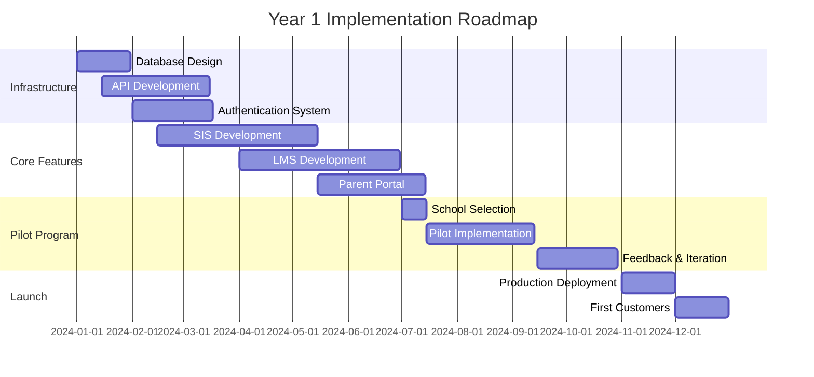

# Education Systems SaaS Transformation Plan

## Executive Summary

Transform the Education Systems demo into a comprehensive Learning Management System (LMS) integrated with Student Information System (SIS) capabilities, serving K-12 schools and districts with AI-powered personalized learning, complete administrative tools, and multi-stakeholder engagement portals.

---

## 1. Product Vision & Scope

### Core Platform Components

#### Learning Management System (LMS)
- **Course Management**: Curriculum mapping, lesson planning, content delivery
- **Assignment & Assessment**: Creation, distribution, submission, auto-grading
- **Interactive Learning**: Virtual classrooms, collaborative spaces, discussion forums
- **Content Repository**: Videos, documents, interactive materials, SCORM support
- **Progress Tracking**: Real-time monitoring, competency-based progression

#### Student Information System (SIS)
- **Enrollment Management**: Registration, scheduling, waitlists, prerequisites
- **Attendance Tracking**: Daily/period attendance, tardiness, absence reasons
- **Gradebook**: Weighted calculations, standards-based grading, report cards
- **Transcripts**: Official records, credit tracking, graduation requirements
- **Demographics**: Student profiles, emergency contacts, medical information

#### AI-Powered Adaptive Learning
- **Personalized Tutoring**: GPT-4/Claude integration for subject-specific help
- **Learning Path Optimization**: Dynamic curriculum adjustment based on performance
- **Skill Gap Analysis**: Identify and address knowledge deficiencies
- **Predictive Analytics**: Early warning system for at-risk students
- **Content Recommendations**: AI-driven resource suggestions

#### Parent-Teacher Communication
- **Messaging Platform**: Secure two-way communication with read receipts
- **Progress Reports**: Real-time grade updates, behavioral notes
- **Conference Scheduling**: Online booking, video conferencing integration
- **Homework Help**: Parent resources, assignment visibility
- **Event Management**: School activities, volunteer coordination

#### Assessment and Grading
- **Multiple Assessment Types**: Formative, summative, diagnostic, portfolio
- **Question Banks**: Metadata-rich, standards-aligned, difficulty-rated
- **Auto-Grading**: Objective questions, AI-assisted essay evaluation
- **Rubric Management**: Customizable scoring guides, peer assessment
- **Analytics**: Item analysis, common misconceptions, performance trends

### Target Users
- **Students**: K-12 learners, special education, gifted programs, remote learners
- **Teachers**: Classroom instructors, special education, support staff
- **Parents/Guardians**: Primary caregivers, extended family access
- **Administrators**: Principals, department heads, district officials
- **Support Staff**: Counselors, nurses, librarians, IT administrators

---

## 2. Database Architecture

### Core Schema Design

```sql
-- Multi-tenant organization hierarchy
CREATE TABLE organizations (
    id UUID PRIMARY KEY,
    type VARCHAR(20) CHECK (type IN ('district', 'school', 'department')),
    parent_id UUID REFERENCES organizations(id),
    name VARCHAR(255) NOT NULL,
    settings JSONB,
    created_at TIMESTAMP DEFAULT NOW()
);

-- User management with role-based access
CREATE TABLE users (
    id UUID PRIMARY KEY,
    organization_id UUID REFERENCES organizations(id),
    email VARCHAR(255) UNIQUE,
    role VARCHAR(20) CHECK (role IN ('student', 'teacher', 'parent', 'admin', 'staff')),
    profile JSONB,
    settings JSONB,
    created_at TIMESTAMP DEFAULT NOW()
);

-- Academic structure
CREATE TABLE academic_years (
    id UUID PRIMARY KEY,
    organization_id UUID REFERENCES organizations(id),
    name VARCHAR(100),
    start_date DATE,
    end_date DATE,
    terms JSONB -- Array of term definitions
);

CREATE TABLE courses (
    id UUID PRIMARY KEY,
    organization_id UUID REFERENCES organizations(id),
    code VARCHAR(50),
    name VARCHAR(255),
    description TEXT,
    credits DECIMAL(3,1),
    prerequisites JSONB,
    standards JSONB,
    grade_levels INTEGER[]
);

CREATE TABLE classes (
    id UUID PRIMARY KEY,
    course_id UUID REFERENCES courses(id),
    academic_year_id UUID REFERENCES academic_years(id),
    teacher_id UUID REFERENCES users(id),
    period VARCHAR(20),
    room VARCHAR(50),
    capacity INTEGER,
    schedule JSONB
);

-- Enrollment and attendance
CREATE TABLE enrollments (
    id UUID PRIMARY KEY,
    student_id UUID REFERENCES users(id),
    class_id UUID REFERENCES classes(id),
    enrollment_date DATE,
    status VARCHAR(20),
    final_grade VARCHAR(10),
    credits_earned DECIMAL(3,1)
);

CREATE TABLE attendance (
    id UUID PRIMARY KEY,
    student_id UUID REFERENCES users(id),
    class_id UUID REFERENCES classes(id),
    date DATE,
    status VARCHAR(20) CHECK (status IN ('present', 'absent', 'tardy', 'excused')),
    notes TEXT
) PARTITION BY RANGE (date);

-- Assignments and submissions
CREATE TABLE assignments (
    id UUID PRIMARY KEY,
    class_id UUID REFERENCES classes(id),
    title VARCHAR(255),
    type VARCHAR(50),
    instructions TEXT,
    due_date TIMESTAMP,
    points_possible DECIMAL(6,2),
    rubric_id UUID,
    settings JSONB
);

CREATE TABLE submissions (
    id UUID PRIMARY KEY,
    assignment_id UUID REFERENCES assignments(id),
    student_id UUID REFERENCES users(id),
    submitted_at TIMESTAMP,
    content JSONB,
    attachments JSONB,
    score DECIMAL(6,2),
    feedback TEXT,
    graded_by UUID REFERENCES users(id),
    version INTEGER DEFAULT 1
);

-- Learning content
CREATE TABLE learning_resources (
    id UUID PRIMARY KEY,
    organization_id UUID REFERENCES organizations(id),
    created_by UUID REFERENCES users(id),
    type VARCHAR(50),
    title VARCHAR(255),
    content_url TEXT,
    metadata JSONB,
    license VARCHAR(100),
    accessibility_features JSONB,
    analytics JSONB
);

-- AI and analytics
CREATE TABLE learning_profiles (
    id UUID PRIMARY KEY,
    student_id UUID REFERENCES users(id) UNIQUE,
    learning_style JSONB,
    strengths JSONB,
    weaknesses JSONB,
    interests JSONB,
    pace_preference VARCHAR(20),
    last_updated TIMESTAMP
);

CREATE TABLE ai_interactions (
    id UUID PRIMARY KEY,
    student_id UUID REFERENCES users(id),
    session_id UUID,
    subject VARCHAR(100),
    question TEXT,
    response TEXT,
    effectiveness_score DECIMAL(3,2),
    timestamp TIMESTAMP DEFAULT NOW()
);

-- Communications
CREATE TABLE messages (
    id UUID PRIMARY KEY,
    sender_id UUID REFERENCES users(id),
    recipient_ids UUID[],
    subject VARCHAR(255),
    body TEXT,
    attachments JSONB,
    read_receipts JSONB,
    sent_at TIMESTAMP DEFAULT NOW()
);

-- Enable Row Level Security
ALTER TABLE users ENABLE ROW LEVEL SECURITY;
ALTER TABLE enrollments ENABLE ROW LEVEL SECURITY;
ALTER TABLE attendance ENABLE ROW LEVEL SECURITY;
ALTER TABLE submissions ENABLE ROW LEVEL SECURITY;
ALTER TABLE messages ENABLE ROW LEVEL SECURITY;

-- RLS Policies Example
CREATE POLICY "Students see own data" ON submissions
    FOR SELECT USING (auth.uid() = student_id);

CREATE POLICY "Teachers see their class submissions" ON submissions
    FOR SELECT USING (
        EXISTS (
            SELECT 1 FROM classes c
            JOIN assignments a ON a.class_id = c.id
            WHERE a.id = submissions.assignment_id
            AND c.teacher_id = auth.uid()
        )
    );

CREATE POLICY "Parents see children's data" ON submissions
    FOR SELECT USING (
        EXISTS (
            SELECT 1 FROM parent_student_relationships psr
            WHERE psr.parent_id = auth.uid()
            AND psr.student_id = submissions.student_id
        )
    );
```

### Data Partitioning Strategy
- **Attendance**: Partition by academic year and month
- **Submissions**: Partition by academic year
- **AI Interactions**: Partition by month for performance
- **Messages**: Archive after 2 years to cold storage

### Multi-Tenancy Implementation
- Organization-based isolation using RLS
- Separate schemas for large districts (10,000+ students)
- Shared resources with tenant_resources junction table
- Cross-tenant analytics with anonymization

---

## 3. Authentication & Authorization

### User Authentication Flows

#### Student Authentication
- **K-5**: Picture password or PIN with teacher assistance
- **6-8**: Username/password with parental reset capability
- **9-12**: Full authentication with MFA option
- **18+**: Adult learner mode with full control

#### Teacher/Staff Authentication
- **Primary**: Email/password with mandatory MFA
- **SSO Integration**: SAML 2.0, OAuth 2.0, Active Directory
- **Session Management**: 8-hour timeout, concurrent session limits
- **API Keys**: For gradebook integrations, LTI tools

#### Parent/Guardian Authentication
- **Verification**: Email/SMS verification with student ID
- **Multiple Children**: Single account, multiple student associations
- **Delegated Access**: Grandparents, caregivers with limited permissions
- **Consent Management**: COPPA compliance for under-13 access

### Role-Based Permissions Matrix

| Feature | Student | Teacher | Parent | Admin | District |
|---------|---------|---------|---------|--------|----------|
| View Grades | Own | Class | Children | School | All |
| Submit Assignments | Yes | No | No | No | No |
| Create Assignments | No | Yes | No | Yes | Yes |
| Message Teachers | Yes | Receive | Yes | Yes | Yes |
| View Analytics | Limited | Class | Children | School | All |
| Manage Enrollment | No | No | No | Yes | Yes |
| Access AI Tutor | Yes | Demo | Monitor | Monitor | Analytics |
| Export Data | Own | Class | Children | School | All |

### Compliance Controls
- **FERPA**: Audit logs, consent tracking, data minimization
- **COPPA**: Parental consent workflow, age verification
- **GDPR**: Data portability, right to deletion, consent management
- **State Laws**: California CCPA, SOPIPA compliance

---

## 4. API Design

### RESTful API Structure

```javascript
// Core API Endpoints
/api/v1/
  /auth/
    POST   /login
    POST   /logout
    POST   /refresh
    POST   /reset-password
    GET    /verify-email/:token

  /users/
    GET    /profile
    PUT    /profile
    GET    /students
    GET    /teachers
    GET    /parents

  /enrollment/
    GET    /courses
    GET    /classes
    POST   /register
    DELETE /drop/:enrollmentId
    GET    /schedule

  /assignments/
    GET    /
    POST   /
    GET    /:id
    PUT    /:id
    DELETE /:id
    POST   /:id/submit
    GET    /:id/submissions
    POST   /:id/grade

  /grades/
    GET    /gradebook/:classId
    GET    /transcript/:studentId
    POST   /calculate
    GET    /report-card

  /attendance/
    GET    /
    POST   /mark
    GET    /report
    POST   /excuse

  /content/
    GET    /resources
    POST   /upload
    GET    /search
    POST   /share

  /ai/
    POST   /tutor/chat
    GET    /tutor/history
    POST   /recommend
    GET    /learning-path
    POST   /assess

  /communications/
    GET    /messages
    POST   /send
    GET    /announcements
    POST   /schedule-conference

  /analytics/
    GET    /student/:id
    GET    /class/:id
    GET    /school/:id
    GET    /predictions
    POST   /generate-report
```

### GraphQL Schema

```graphql
type Query {
  # User queries
  currentUser: User!
  student(id: ID!): Student
  teacher(id: ID!): Teacher

  # Academic queries
  courses(filters: CourseFilter): [Course!]!
  classes(studentId: ID, teacherId: ID): [Class!]!
  assignments(classId: ID!, status: AssignmentStatus): [Assignment!]!

  # Performance queries
  grades(studentId: ID!, classId: ID): GradeReport
  attendance(studentId: ID!, dateRange: DateRange): AttendanceReport
  analytics(entityId: ID!, entityType: EntityType!): AnalyticsData

  # AI queries
  learningPath(studentId: ID!): LearningPath
  recommendations(studentId: ID!, subject: String): [Resource!]!
}

type Mutation {
  # Assignment operations
  createAssignment(input: AssignmentInput!): Assignment!
  submitAssignment(assignmentId: ID!, submission: SubmissionInput!): Submission!
  gradeSubmission(submissionId: ID!, grade: GradeInput!): Grade!

  # Communication operations
  sendMessage(input: MessageInput!): Message!
  scheduleConference(input: ConferenceInput!): Conference!

  # AI operations
  startTutorSession(subject: String!): TutorSession!
  sendTutorMessage(sessionId: ID!, message: String!): TutorResponse!
}

type Subscription {
  # Real-time updates
  gradeUpdated(studentId: ID!): Grade!
  assignmentPosted(classId: ID!): Assignment!
  messageReceived(userId: ID!): Message!
  attendanceMarked(classId: ID!): Attendance!
}
```

### WebSocket Events

```javascript
// Real-time event system
{
  // Classroom events
  "classroom.join": { classId, userId },
  "classroom.leave": { classId, userId },
  "classroom.hand_raised": { classId, studentId },
  "classroom.poll_started": { classId, pollId },

  // Assignment events
  "assignment.created": { classId, assignmentId },
  "assignment.submitted": { assignmentId, studentId },
  "assignment.graded": { submissionId, grade },

  // Communication events
  "message.sent": { messageId, recipients },
  "message.read": { messageId, readerId },
  "announcement.posted": { announcementId, scope },

  // AI tutor events
  "tutor.thinking": { sessionId },
  "tutor.response": { sessionId, message },
  "tutor.resource_suggested": { sessionId, resources }
}
```

---

## 5. Frontend Architecture

### Teacher Dashboard

```typescript
// Core Components Structure
/components/teacher/
  Dashboard/
    ClassOverview.tsx         // Today's schedule, notifications
    QuickActions.tsx          // Grade assignments, take attendance
    StudentAlerts.tsx         // At-risk students, missing work

  Gradebook/
    GradebookTable.tsx        // Spreadsheet-like grade entry
    BulkGradeEntry.tsx        // Quick grading mode
    RubricGrader.tsx          // Standards-based assessment
    GradeAnalytics.tsx        // Class performance visualization

  LessonPlanning/
    LessonBuilder.tsx         // Drag-drop lesson creator
    CurriculumMapper.tsx      // Standards alignment
    ResourceLibrary.tsx       // Content repository
    AIAssistant.tsx           // GPT-powered content suggestions

  Communication/
    MessageCenter.tsx         // Parent communication hub
    AnnouncementComposer.tsx  // Class/school announcements
    ConferenceScheduler.tsx   // Parent-teacher conferences
```

### Student Portal

```typescript
/components/student/
  Dashboard/
    PersonalizedHome.tsx      // AI-curated learning feed
    UpcomingWork.tsx          // Assignment tracker
    ProgressTracker.tsx       // Goal monitoring
    AchievementBadges.tsx     // Gamification elements

  Learning/
    CourseViewer.tsx          // Interactive lessons
    AssignmentSubmitter.tsx   // Work submission interface
    AITutor.tsx               // Conversational tutoring
    PeerCollaboration.tsx     // Group work spaces

  Portfolio/
    WorkShowcase.tsx          // Best work collection
    SkillsProfile.tsx        // Competency visualization
    ReflectionJournal.tsx     // Learning reflections
```

### Parent Portal

```typescript
/components/parent/
  Dashboard/
    ChildrenOverview.tsx      // Multi-child summary
    GradeMonitor.tsx          // Real-time grade tracking
    AttendanceTracker.tsx     // Absence notifications

  Communication/
    TeacherMessaging.tsx      // Direct teacher contact
    ConferenceBooking.tsx     // Schedule meetings
    SchoolAnnouncements.tsx   // Important updates

  Support/
    HomeworkHelper.tsx        // Assignment visibility
    ResourceCenter.tsx       // Parent resources
    PaymentManager.tsx        // Fees, lunch, activities
```

### Administrator Console

```typescript
/components/admin/
  Operations/
    EnrollmentManager.tsx     // Student registration
    StaffScheduler.tsx        // Teacher assignments
    FacilityManager.tsx       // Room allocation

  Analytics/
    SchoolDashboard.tsx       // KPI monitoring
    PerformanceReports.tsx    // Academic analytics
    ComplianceTracker.tsx     // Regulatory compliance

  Configuration/
    SystemSettings.tsx        // Platform configuration
    IntegrationManager.tsx    // Third-party connections
    SecurityControls.tsx      // Access management
```

### Mobile App Architecture

```typescript
// React Native structure
/mobile/
  /shared/
    Navigation.tsx            // Bottom tab + stack navigation
    AuthProvider.tsx          // Biometric authentication
    OfflineSync.tsx           // Local data management

  /screens/
    /teacher/
      QuickAttendance.tsx     // Swipe-based marking
      MobileGradebook.tsx     // Simplified grading

    /student/
      TodayView.tsx           // Daily schedule
      QuickSubmit.tsx         // Photo submission
      MobileAITutor.tsx       // Voice-based tutoring

    /parent/
      NotificationCenter.tsx  // Push notifications
      QuickMessage.tsx        // Teacher messaging
```

---

## 6. Backend Services

### Core Microservices

#### Identity Service
```javascript
// Authentication & authorization
- JWT token management with refresh tokens
- Role-based access control (RBAC)
- Session management with Redis
- MFA implementation (TOTP, SMS)
- SSO integration (SAML, OAuth)
- Password policies and rotation
```

#### Enrollment Service
```javascript
// Course registration & scheduling
- Prerequisite checking algorithm
- Waitlist management with auto-enrollment
- Schedule conflict resolution
- Capacity management
- Drop/add period handling
- Transfer credit evaluation
```

#### Assessment Service
```javascript
// Assignment & grading engine
- Multiple question types support
- Auto-grading for objective questions
- Rubric-based evaluation
- Plagiarism detection (Turnitin API)
- Grade calculation (weighted, points, standards)
- Late submission policies
```

#### AI Tutoring Service
```javascript
// Intelligent tutoring system
class AITutorService {
  // Core capabilities
  - Subject-specific model selection
  - Context-aware responses
  - Learning style adaptation
  - Socratic questioning
  - Hint generation
  - Solution explanation

  // Integration points
  - OpenAI GPT-4 API
  - Anthropic Claude API
  - Subject-specific fine-tuning
  - Content safety filtering
  - Response quality scoring
}
```

#### Analytics Service
```javascript
// Learning analytics engine
- Real-time progress tracking
- Predictive modeling (dropout risk)
- Performance trend analysis
- Engagement metrics
- Learning path optimization
- Comparative analytics
- Custom report generation
```

#### Communication Service
```javascript
// Messaging & notifications
- Multi-channel delivery (email, SMS, push)
- Message templating system
- Translation services
- Read receipt tracking
- Scheduled sending
- Bulk communication tools
- Emergency broadcast system
```

#### Content Service
```javascript
// Learning resource management
- File upload/processing (videos, docs, SCORM)
- Transcoding pipeline
- CDN integration
- Metadata extraction
- Version control
- Access control
- Usage analytics
```

### Background Job Processing

```javascript
// Bull queue configuration
const queues = {
  gradeCalculation: {
    // Recalculate grades after assignment updates
    concurrency: 5,
    rateLimit: { max: 100, duration: 60000 }
  },

  reportGeneration: {
    // Generate PDF report cards, transcripts
    concurrency: 3,
    priority: true
  },

  emailNotifications: {
    // Send emails for various events
    concurrency: 10,
    backoff: { type: 'exponential', delay: 2000 }
  },

  aiProcessing: {
    // AI tutoring, content generation
    concurrency: 2,
    timeout: 300000
  },

  dataSync: {
    // Sync with external SIS systems
    cron: '0 2 * * *',
    removeOnComplete: true
  }
};
```

### Caching Strategy

```javascript
// Redis caching layers
const cacheConfig = {
  session: {
    ttl: 28800,  // 8 hours
    prefix: 'sess:'
  },

  gradebook: {
    ttl: 300,     // 5 minutes
    prefix: 'grade:',
    invalidateOn: ['submission', 'grade_update']
  },

  schedule: {
    ttl: 3600,    // 1 hour
    prefix: 'sched:'
  },

  analytics: {
    ttl: 900,     // 15 minutes
    prefix: 'stats:'
  },

  content: {
    ttl: 86400,   // 24 hours
    prefix: 'cont:'
  }
};
```

---

## 7. Technical Stack Recommendations

### Infrastructure

#### Cloud Platform
- **AWS Education Credits Program**
  - EC2/EKS for compute
  - RDS PostgreSQL for database
  - S3 for object storage
  - CloudFront for CDN
  - ElastiCache for Redis
  - SQS for message queuing

#### Video Infrastructure
- **Mux** for video processing and streaming
- **Daily.co** for virtual classrooms
- **Agora** for peer tutoring sessions
- **AWS IVS** for live streaming events

#### AI/ML Platform
- **OpenAI GPT-4** for conversational tutoring
- **Anthropic Claude** for content generation
- **Hugging Face** for custom models
- **AWS SageMaker** for predictive analytics
- **Pinecone** for vector search (content discovery)

#### Development Stack

```yaml
Frontend:
  - Next.js 15 (App Router)
  - TypeScript 5.0+
  - Tailwind CSS
  - Radix UI components
  - React Query (data fetching)
  - Zustand (state management)
  - React Three Fiber (3D content)
  - Recharts (data visualization)

Backend:
  - Node.js with Express/Fastify
  - PostgreSQL 15+
  - Redis for caching
  - Bull for job queues
  - GraphQL with Apollo Server
  - Prisma ORM
  - Socket.io for real-time

Mobile:
  - React Native
  - Expo for development
  - React Native Paper (UI)
  - AsyncStorage for offline
  - React Navigation

DevOps:
  - Docker containers
  - Kubernetes orchestration
  - GitHub Actions CI/CD
  - Terraform for IaC
  - DataDog monitoring
  - Sentry error tracking
```

### Third-Party Integrations

```javascript
// Essential educational integrations
const integrations = {
  // Student Information Systems
  sis: ['PowerSchool', 'Infinite Campus', 'Skyward', 'Clever'],

  // Learning standards
  standards: ['Common Core', 'NGSS', 'State Standards APIs'],

  // Assessment tools
  assessment: ['Turnitin', 'ExamSoft', 'ProctorU'],

  // Content providers
  content: ['Khan Academy', 'IXL', 'Newsela', 'BrainPOP'],

  // Communication
  communication: ['Remind', 'ClassDojo', 'Twilio', 'SendGrid'],

  // Payments
  payments: ['Stripe', 'PayPal', 'Square for Schools'],

  // Analytics
  analytics: ['Google Analytics 4', 'Mixpanel', 'Amplitude']
};
```

---

## 8. Compliance & Security

### Educational Compliance

#### FERPA (Family Educational Rights and Privacy Act)
- **Access Controls**: Role-based access to student records
- **Audit Logging**: Track all access to educational records
- **Parent Rights**: Access, review, request amendments
- **Consent Management**: Track disclosure permissions
- **Data Retention**: 5-year minimum for transcripts

#### COPPA (Children's Online Privacy Protection Act)
- **Age Verification**: Birth date collection with school verification
- **Parental Consent**: Active consent for under-13 users
- **Data Minimization**: Collect only necessary information
- **No Behavioral Advertising**: Prohibited for minors
- **Deletion Rights**: Parent-requested data removal

#### Accessibility (WCAG 2.1 AA)
- **Screen Reader Support**: ARIA labels, semantic HTML
- **Keyboard Navigation**: Full functionality without mouse
- **Color Contrast**: 4.5:1 minimum ratio
- **Captions**: Auto-generated for videos
- **Text Alternatives**: Alt text for images

### Security Framework

```javascript
// Security implementation checklist
const securityMeasures = {
  authentication: {
    passwordPolicy: {
      minLength: 12,
      requireUppercase: true,
      requireNumbers: true,
      requireSpecial: true,
      preventReuse: 5,
      expirationDays: 90
    },
    mfa: {
      required: ['admin', 'teacher'],
      optional: ['parent', 'student'],
      methods: ['totp', 'sms', 'email']
    }
  },

  encryption: {
    inTransit: 'TLS 1.3',
    atRest: 'AES-256',
    database: 'Transparent Data Encryption',
    backups: 'Encrypted S3 buckets'
  },

  dataProtection: {
    pii: 'Field-level encryption',
    exports: 'Watermarked, tracked downloads',
    sharing: 'Time-limited, audited links',
    deletion: 'Secure overwrite, backup purge'
  },

  monitoring: {
    siem: 'Real-time threat detection',
    ids: 'Intrusion detection system',
    vulnerability: 'Weekly scans',
    penetration: 'Annual testing'
  }
};
```

### Compliance Checklist

| Regulation | Requirements | Implementation |
|------------|--------------|----------------|
| FERPA | Educational records privacy | RLS, audit logs, consent tracking |
| COPPA | Children's privacy (under 13) | Parental consent, data minimization |
| GDPR | EU data protection | Data portability, right to deletion |
| CCPA | California privacy | Disclosure, opt-out, non-discrimination |
| SOPIPA | Student online privacy | No targeted advertising, data security |
| IDEA | Special education | Accessibility, IEP management |
| Section 508 | Federal accessibility | WCAG compliance, assistive tech |
| CIPA | Internet safety | Content filtering, monitoring |

---

## 9. Migration Path

### Phase 1: Foundation (Months 1-3)
**Core SIS Functionality**
- User authentication system
- Basic enrollment management
- Gradebook functionality
- Attendance tracking
- Parent portal (read-only)

**Success Metrics**:
- 100% user account creation
- All current students enrolled
- Teachers trained on gradebook

### Phase 2: LMS Integration (Months 4-6)
**Learning Management**
- Assignment creation/submission
- Content repository
- Basic auto-grading
- Discussion forums
- Calendar integration

**Success Metrics**:
- 50% assignments digital
- 80% teacher adoption
- Parent engagement > 60%

### Phase 3: Communication (Months 7-8)
**Engagement Tools**
- Messaging system
- Announcements
- Conference scheduling
- Mobile apps launch
- Push notifications

**Success Metrics**:
- 90% parents connected
- Message response < 24 hours
- App downloads > 75%

### Phase 4: Advanced Features (Months 9-12)
**AI & Analytics**
- AI tutoring launch
- Predictive analytics
- Advanced reporting
- Third-party integrations
- API marketplace

**Success Metrics**:
- AI tutor usage > 40%
- Early warning accuracy > 80%
- API integrations > 10

### Data Migration Strategy

```javascript
// Migration workflow
const migrationPlan = {
  preparation: {
    dataAudit: 'Identify all source systems',
    mapping: 'Create field mappings',
    cleaning: 'Standardize, deduplicate',
    validation: 'Data quality checks'
  },

  execution: {
    historicalData: {
      // Past academic years
      grades: 'Last 3 years',
      attendance: 'Current year only',
      transcripts: 'Full history'
    },

    activeData: {
      // Current semester
      timing: 'Weekend migration',
      fallback: 'Parallel run for 2 weeks',
      verification: 'Automated + manual checks'
    }
  },

  rollback: {
    checkpoints: 'After each major entity',
    backups: 'Full system before start',
    procedures: 'Documented rollback steps'
  }
};
```

### Training Program

```yaml
Teacher Training:
  Phase 1 (Pre-launch):
    - 2-day intensive workshop
    - Hands-on lab environment
    - Role-specific scenarios
    - Certification program

  Phase 2 (Launch):
    - Daily office hours
    - Embedded support staff
    - Video tutorials library
    - Peer mentorship program

  Phase 3 (Ongoing):
    - Monthly feature workshops
    - Summer professional development
    - Advanced certification tracks
    - Teacher community forum

Parent Onboarding:
  - Welcome email sequence
  - Video walkthrough
  - FAQ documentation
  - Live Q&A sessions
  - Multi-language support

Student Training:
  - Age-appropriate tutorials
  - Gamified onboarding
  - Peer ambassadors
  - In-class demonstrations
```

### Change Management

```javascript
const changeManagement = {
  stakeholders: {
    champions: 'Identify early adopters in each school',
    skeptics: 'Address concerns proactively',
    leadership: 'Regular progress briefings'
  },

  communication: {
    channels: ['Email', 'Town halls', 'Newsletters', 'Social media'],
    frequency: 'Weekly during transition',
    feedback: 'Anonymous surveys, focus groups'
  },

  support: {
    helpdesk: '24/7 during first month',
    documentation: 'Comprehensive knowledge base',
    escalation: 'Clear paths for issues'
  },

  metrics: {
    adoption: 'Daily active users',
    satisfaction: 'NPS scores',
    efficiency: 'Time saved metrics',
    outcomes: 'Student performance'
  }
};
```

---

## 10. Business Model & Pricing

### SaaS Pricing Tiers

```yaml
Starter (Up to 500 students):
  Price: $2,500/month
  Features:
    - Core SIS functionality
    - Basic LMS
    - Parent portal
    - Email support
    - 100GB storage

Professional (501-2,000 students):
  Price: $7,500/month
  Features:
    - Everything in Starter
    - AI tutoring (1,000 sessions/month)
    - Advanced analytics
    - API access
    - Priority support
    - 500GB storage
    - Custom branding

Enterprise (2,000+ students):
  Price: Custom pricing
  Features:
    - Everything in Professional
    - Unlimited AI tutoring
    - Custom integrations
    - Dedicated success manager
    - SLA guarantees
    - Unlimited storage
    - White labeling
    - On-premise option

Add-on Modules:
  - Test Prep Suite: $500/month
  - Special Education Management: $1,000/month
  - Athletic Management: $750/month
  - Transportation Routing: $500/month
  - Advanced Analytics: $1,500/month
  - API Premium (higher limits): $500/month
```

### Revenue Streams

1. **Subscription Revenue** (75% of revenue)
   - Monthly/annual subscriptions
   - Multi-year contracts with discounts
   - Seasonal adjustments for school calendar

2. **Professional Services** (15% of revenue)
   - Implementation: $25,000-100,000
   - Training: $5,000/day
   - Custom development: $250/hour
   - Data migration: $15,000-50,000

3. **Marketplace** (10% of revenue)
   - 30% commission on third-party apps
   - Premium content licensing
   - Teacher-created content sales

### Market Opportunity

```javascript
const marketAnalysis = {
  tam: {
    // Total Addressable Market
    k12Schools: 130000,  // US K-12 schools
    averageStudents: 500,
    potentialRevenue: '$4.9B annually'
  },

  sam: {
    // Serviceable Addressable Market
    targetSchools: 20000,  // Mid-size districts
    conversionRate: 0.10,
    expectedRevenue: '$180M annually'
  },

  som: {
    // Serviceable Obtainable Market
    year1: 50,     // Schools
    year2: 250,
    year3: 750,
    year5: 2000,
    year5Revenue: '$180M ARR'
  }
};
```

### Success Metrics

```yaml
Business Metrics:
  - MRR/ARR growth
  - Customer Acquisition Cost (CAC)
  - Lifetime Value (LTV)
  - Churn rate (< 5% annually)
  - Net Revenue Retention (> 110%)

Product Metrics:
  - Daily Active Users (DAU)
  - Feature adoption rates
  - Assignment submission rates
  - AI tutor engagement
  - Parent portal usage

Educational Outcomes:
  - Student performance improvement
  - Graduation rate impact
  - Parent engagement increase
  - Teacher time saved
  - Early intervention success rate

Operational Metrics:
  - System uptime (99.9%)
  - Response time (< 2 seconds)
  - Support ticket resolution (< 24 hours)
  - Data accuracy (99.99%)
  - Security incidents (zero tolerance)
```

---

## 11. Risk Analysis & Mitigation

### Technical Risks

| Risk | Impact | Likelihood | Mitigation |
|------|--------|------------|------------|
| Data breach | Critical | Medium | Encryption, monitoring, insurance |
| System downtime | High | Medium | Redundancy, auto-scaling, DR plan |
| AI hallucinations | Medium | High | Human review, confidence scoring |
| Integration failures | Medium | Medium | Fallback systems, manual processes |
| Performance degradation | Medium | Medium | Load testing, capacity planning |

### Compliance Risks

| Risk | Impact | Likelihood | Mitigation |
|------|--------|------------|------------|
| FERPA violation | Critical | Low | Training, access controls, audits |
| COPPA non-compliance | High | Medium | Age verification, consent workflows |
| Accessibility lawsuits | High | Medium | WCAG compliance, regular testing |
| Data residency issues | Medium | Low | Region-specific deployments |

### Business Risks

| Risk | Impact | Likelihood | Mitigation |
|------|--------|------------|------------|
| Slow adoption | High | Medium | Phased rollout, change management |
| Competition from giants | High | Medium | Differentiation, partnerships |
| Budget constraints | High | High | Flexible pricing, grants |
| Teacher resistance | Medium | High | Training, support, incentives |

---

## 12. Implementation Timeline

### Year 1: Foundation & Launch



### Success Criteria

**Year 1 Goals**:
- 50 schools onboarded
- 25,000 active users
- $2M ARR
- 95% uptime
- NPS > 40

**Year 3 Goals**:
- 750 schools
- 375,000 active users
- $67M ARR
- 99.9% uptime
- NPS > 60

**Year 5 Goals**:
- 2,000 schools
- 1M active users
- $180M ARR
- Market leader position
- IPO readiness

---

## Conclusion

The transformation of the Education Systems demo into a comprehensive SaaS platform represents a significant opportunity in the EdTech market. By focusing on AI-powered personalized learning, robust administrative tools, and strong compliance frameworks, this platform can revolutionize how schools manage education delivery and student success.

Key success factors:
1. **Phased implementation** to manage complexity and ensure adoption
2. **Strong compliance** framework for educational regulations
3. **AI differentiation** for personalized learning at scale
4. **Multi-stakeholder design** serving students, teachers, parents, and administrators
5. **Robust infrastructure** capable of handling school-scale operations

The platform's architecture emphasizes scalability, security, and educational outcomes, positioning it as a next-generation solution for K-12 education management.