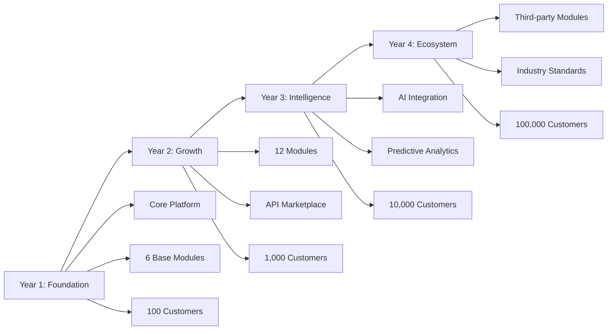

# CORE UNIFIED PLATFORM ARCHITECTURE
## Horizon Systems - One Platform, Multiple Intelligent Modules

*Version: 1.0.0*
*Last Updated: October 2025*
*Architecture Status: Foundation Design*

---

## 1. PLATFORM OVERVIEW

### 1.1 Core Concept
Horizon Systems is **NOT** a collection of separate applications. It is a **single unified platform** with intelligent modules that organizations subscribe to based on their needs. Think of it as the "Zoho Suite" or "Microsoft 365" for specialized business operations.

### 1.2 Architecture Principles

#### Single Application Architecture
- **One codebase**: Monolithic frontend, modular backend
- **One deployment**: All modules deploy together
- **One login**: Single sign-on for all modules
- **One database**: Unified data model with schema separation
- **One bill**: Consolidated subscription and billing

#### Module-Based System Design
```
┌─────────────────────────────────────────────────────────┐
│                   HORIZON PLATFORM                       │
├─────────────────────────────────────────────────────────┤
│                    Core Services                         │
│  [Auth] [Billing] [Notifications] [Audit] [Storage]     │
├─────────────────────────────────────────────────────────┤
│                   Module Layer                           │
│ ┌──────┐ ┌──────┐ ┌──────┐ ┌──────┐ ┌──────┐         │
│ │Voice │ │Loc.  │ │3D    │ │Anal. │ │People│  ...     │
│ └──────┘ └──────┘ └──────┘ └──────┘ └──────┘         │
├─────────────────────────────────────────────────────────┤
│              Unified Data Layer (Supabase)              │
└─────────────────────────────────────────────────────────┘
```

#### Component Classification

**Shared Components** (70% of codebase):
- Authentication & authorization
- Navigation & layout
- UI components (buttons, forms, modals)
- Data tables & visualizations
- File upload/download
- Notification system
- Search interface
- Dashboard framework

**Module-Specific Components** (30% of codebase):
- Domain-specific workflows
- Specialized visualizations
- Industry-specific integrations
- Custom business logic

---

## 2. UNIFIED DATABASE DESIGN

### 2.1 Database Architecture
**Single Supabase Project**: `sjbvvrjxsbqrgtpgdxwr`

### 2.2 Schema Organization Strategy

```sql
-- Core Schema: Platform-wide entities
CREATE SCHEMA core;

-- Core Tables
core.organizations          -- Multi-tenant organizations
core.users                  -- Platform users
core.user_organizations     -- User-org relationships (many-to-many)
core.module_subscriptions   -- Which modules each org has access to
core.module_catalog         -- Available modules and pricing
core.billing_accounts       -- Payment and billing information
core.audit_logs            -- Platform-wide audit trail
core.notifications         -- Unified notification queue
core.api_keys             -- API access tokens
core.webhooks             -- Webhook configurations
core.events               -- Event bus for inter-module communication

-- Module Schemas: Domain-specific data
CREATE SCHEMA inventory;
CREATE SCHEMA analytics;
CREATE SCHEMA voice;
CREATE SCHEMA location;
CREATE SCHEMA three_d;
CREATE SCHEMA people;
CREATE SCHEMA recruitment;
CREATE SCHEMA legal;
CREATE SCHEMA real_estate;
CREATE SCHEMA healthcare;
CREATE SCHEMA hospitality;
CREATE SCHEMA education;
```

### 2.3 Cross-Module Relationships

```sql
-- Example: Inventory warehouse belongs to organization
ALTER TABLE inventory.warehouses
  ADD CONSTRAINT fk_organization
  FOREIGN KEY (organization_id)
  REFERENCES core.organizations(id);

-- Example: Analytics can reference any module's data
CREATE TABLE analytics.data_sources (
  id UUID PRIMARY KEY,
  organization_id UUID REFERENCES core.organizations(id),
  source_schema TEXT, -- 'inventory', 'recruitment', etc.
  source_table TEXT,  -- 'warehouses', 'applications', etc.
  source_filters JSONB -- Dynamic filtering
);
```

### 2.4 Multi-Tenancy Implementation

```sql
-- Row Level Security on ALL schemas
ALTER TABLE inventory.warehouses ENABLE ROW LEVEL SECURITY;

CREATE POLICY "org_isolation" ON inventory.warehouses
  FOR ALL
  USING (organization_id = current_setting('app.current_org_id')::UUID);

-- Apply similar RLS policies to every table in every schema
```

### 2.5 Data Partitioning Strategy

```sql
-- Partition large tables by organization and time
CREATE TABLE core.audit_logs (
  id UUID,
  organization_id UUID,
  created_at TIMESTAMPTZ,
  -- ... other fields
) PARTITION BY RANGE (created_at);

-- Create monthly partitions
CREATE TABLE core.audit_logs_2025_01
  PARTITION OF core.audit_logs
  FOR VALUES FROM ('2025-01-01') TO ('2025-02-01');
```

---

## 3. UNIFIED AUTHENTICATION & AUTHORIZATION

### 3.1 Single Sign-On Architecture

```typescript
// JWT Token Structure
interface HorizonAuthToken {
  // Standard claims
  sub: string;           // User ID
  exp: number;          // Expiration

  // Custom claims
  org_id: string;       // Current organization
  org_role: 'super_admin' | 'org_admin' | 'org_member';
  modules: {
    [module: string]: string[]; // Module-specific roles
  };

  // Examples:
  // modules: {
  //   inventory: ['warehouse_manager', 'viewer'],
  //   analytics: ['analyst', 'report_creator'],
  //   people: ['hr_admin']
  // }
}
```

### 3.2 Organization-Level User Management

```sql
-- User can belong to multiple organizations
CREATE TABLE core.user_organizations (
  id UUID PRIMARY KEY,
  user_id UUID REFERENCES auth.users(id),
  organization_id UUID REFERENCES core.organizations(id),
  role TEXT NOT NULL, -- 'super_admin', 'org_admin', 'org_member'
  module_roles JSONB, -- {"inventory": ["manager"], "analytics": ["viewer"]}
  invited_at TIMESTAMPTZ,
  joined_at TIMESTAMPTZ,
  is_active BOOLEAN DEFAULT true,
  UNIQUE(user_id, organization_id)
);
```

### 3.3 Module Subscription Model

```sql
CREATE TABLE core.module_subscriptions (
  id UUID PRIMARY KEY,
  organization_id UUID REFERENCES core.organizations(id),
  module_id UUID REFERENCES core.module_catalog(id),
  status TEXT, -- 'trial', 'active', 'suspended', 'cancelled'
  tier TEXT,   -- 'starter', 'professional', 'enterprise'
  subscribed_at TIMESTAMPTZ,
  trial_ends_at TIMESTAMPTZ,
  current_period_end TIMESTAMPTZ,
  seats_limit INTEGER,
  seats_used INTEGER DEFAULT 0,
  usage_limits JSONB, -- Module-specific limits
  custom_pricing JSONB -- For enterprise deals
);
```

### 3.4 Permission System

#### Platform-Level Roles
- **Super Admin**: Full platform access, all orgs, all modules
- **Org Admin**: Full access within organization, manage users and subscriptions
- **Org Member**: Base access, specific module permissions required

#### Module-Level Roles (Examples)
```typescript
const moduleRoles = {
  inventory: ['admin', 'warehouse_manager', 'stock_controller', 'viewer'],
  analytics: ['admin', 'analyst', 'report_creator', 'viewer'],
  people: ['hr_admin', 'hr_manager', 'employee', 'contractor'],
  recruitment: ['admin', 'recruiter', 'hiring_manager', 'interviewer'],
  healthcare: ['admin', 'doctor', 'nurse', 'receptionist', 'patient_manager']
};
```

### 3.5 Row-Level Security Policies

```sql
-- Complex RLS combining org membership and module access
CREATE POLICY "module_access" ON inventory.warehouses
  FOR ALL
  USING (
    -- User belongs to organization
    organization_id IN (
      SELECT organization_id
      FROM core.user_organizations
      WHERE user_id = auth.uid()
        AND is_active = true
    )
    AND
    -- Organization has inventory module subscription
    EXISTS (
      SELECT 1
      FROM core.module_subscriptions ms
      JOIN core.module_catalog mc ON ms.module_id = mc.id
      WHERE ms.organization_id = inventory.warehouses.organization_id
        AND mc.slug = 'inventory'
        AND ms.status = 'active'
    )
  );
```

---

## 4. API ARCHITECTURE

### 4.1 Single API Gateway

```
https://api.horizon-systems.com/v1/
├── /auth
│   ├── /login
│   ├── /logout
│   ├── /refresh
│   └── /organizations
├── /inventory
│   ├── /warehouses
│   ├── /products
│   ├── /stock-movements
│   └── /reports
├── /analytics
│   ├── /dashboards
│   ├── /reports
│   ├── /data-sources
│   └── /visualizations
├── /people
│   ├── /employees
│   ├── /departments
│   ├── /roles
│   └── /timesheets
└── [other modules...]
```

### 4.2 Module Namespacing

```typescript
// API Route Structure
// /api/v1/{module}/{resource}/{id?}/{action?}

// Examples:
GET    /api/v1/inventory/warehouses
POST   /api/v1/inventory/warehouses
GET    /api/v1/inventory/warehouses/123
PUT    /api/v1/inventory/warehouses/123
DELETE /api/v1/inventory/warehouses/123
POST   /api/v1/inventory/warehouses/123/transfer-stock

GET    /api/v1/analytics/reports
POST   /api/v1/analytics/reports/generate
GET    /api/v1/analytics/dashboards/real-time
```

### 4.3 Shared API Patterns

```typescript
// Standardized Response Format
interface ApiResponse<T> {
  success: boolean;
  data?: T;
  error?: {
    code: string;
    message: string;
    details?: any;
  };
  meta?: {
    pagination?: {
      total: number;
      page: number;
      limit: number;
    };
    timestamp: string;
    version: string;
  };
}

// Standardized Query Parameters
interface QueryParams {
  // Pagination
  page?: number;
  limit?: number;

  // Filtering
  filter?: Record<string, any>;

  // Sorting
  sort?: string; // 'field:asc' or 'field:desc'

  // Field selection
  fields?: string[]; // Sparse fieldsets

  // Relationships
  include?: string[]; // Include related resources
}
```

### 4.4 Cross-Module API Calls

```typescript
// Internal Service Layer for Module Communication
class InternalApiService {
  // Only accessible within the platform, not exposed externally
  async crossModuleCall(
    fromModule: string,
    toModule: string,
    endpoint: string,
    data?: any
  ) {
    // Validate module communication permissions
    // Log inter-module calls for debugging
    // Execute call with elevated permissions
  }
}

// Example: Analytics querying Inventory data
const inventoryData = await internalApi.crossModuleCall(
  'analytics',
  'inventory',
  '/internal/aggregate-stock-levels',
  { warehouseIds: [1, 2, 3] }
);
```

---

## 5. FRONTEND ARCHITECTURE

### 5.1 Single Next.js Application

```
/app
├── (auth)
│   ├── login/
│   ├── register/
│   └── forgot-password/
├── (platform)
│   ├── dashboard/          # Module switcher/overview
│   ├── marketplace/        # Browse and subscribe to modules
│   ├── settings/
│   │   ├── organization/
│   │   ├── billing/
│   │   ├── users/
│   │   └── api-keys/
│   ├── inventory/         # Inventory module routes
│   │   ├── warehouses/
│   │   ├── products/
│   │   └── reports/
│   ├── analytics/         # Analytics module routes
│   │   ├── dashboards/
│   │   ├── reports/
│   │   └── insights/
│   ├── people/           # People management routes
│   │   ├── directory/
│   │   ├── departments/
│   │   └── performance/
│   └── [other modules...]
└── api/
    └── v1/
        └── [module]/
            └── [endpoint]/
```

### 5.2 Module-Based Routing

```typescript
// Middleware to check module access
export async function middleware(request: NextRequest) {
  const pathname = request.nextUrl.pathname;
  const module = pathname.split('/')[1]; // Extract module from URL

  // Check if user's org has access to this module
  const hasAccess = await checkModuleAccess(
    request.cookies.get('org_id'),
    module
  );

  if (!hasAccess) {
    return NextResponse.redirect('/marketplace');
  }
}

export const config = {
  matcher: ['/(inventory|analytics|people|recruitment|healthcare)/:path*']
};
```

### 5.3 Shared Component Library

```typescript
// @/components/shared
export * from './layouts/AppShell';
export * from './navigation/ModuleSwitcher';
export * from './tables/DataTable';
export * from './forms/FormBuilder';
export * from './charts/ChartWrapper';
export * from './feedback/Toast';
export * from './overlays/Modal';
export * from './inputs/SearchBar';
export * from './display/StatCard';

// Module-specific components
// @/components/modules/inventory
export * from './WarehouseMap';
export * from './StockLevelIndicator';
export * from './ProductScanner';
```

### 5.4 Module Marketplace UI

```typescript
interface ModuleCard {
  id: string;
  name: string;
  description: string;
  icon: ReactNode;
  category: 'operations' | 'analytics' | 'communication' | 'industry';
  pricing: {
    starter: number;
    professional: number;
    enterprise: 'custom';
  };
  features: string[];
  dependencies?: string[]; // Required modules
  status: 'available' | 'coming_soon' | 'beta';
}

// Marketplace Component
function ModuleMarketplace() {
  const { subscribedModules, availableModules } = useModules();

  return (
    <div className="grid grid-cols-3 gap-6">
      {availableModules.map(module => (
        <ModuleCard
          key={module.id}
          module={module}
          isSubscribed={subscribedModules.includes(module.id)}
          onSubscribe={() => subscribeToModule(module.id)}
        />
      ))}
    </div>
  );
}
```

### 5.5 Unified Dashboard

```typescript
// Main Dashboard showing all subscribed modules
function UnifiedDashboard() {
  const { modules } = useUserModules();

  return (
    <DashboardLayout>
      {/* Quick module switcher */}
      <ModuleGrid>
        {modules.map(module => (
          <ModuleTile
            key={module.id}
            name={module.name}
            icon={module.icon}
            notifications={module.pendingNotifications}
            onClick={() => router.push(`/${module.slug}`)}
          />
        ))}
      </ModuleGrid>

      {/* Aggregated insights from all modules */}
      <CrossModuleInsights>
        <InventoryHighlights />
        <PeopleMetrics />
        <AnalyticsSnapshot />
      </CrossModuleInsights>
    </DashboardLayout>
  );
}
```

---

## 6. MODULE SUBSCRIPTION SYSTEM

### 6.1 Subscription Model

```sql
-- Module Catalog
CREATE TABLE core.module_catalog (
  id UUID PRIMARY KEY,
  slug TEXT UNIQUE,           -- 'inventory', 'analytics', etc.
  name TEXT,                   -- 'Inventory Management'
  description TEXT,
  category TEXT,               -- 'operations', 'analytics', 'industry'
  base_price_monthly DECIMAL,
  base_price_yearly DECIMAL,
  features JSONB,              -- List of features by tier
  dependencies TEXT[],         -- Required modules
  is_active BOOLEAN,
  released_at TIMESTAMPTZ
);

-- Subscription Tiers
CREATE TABLE core.subscription_tiers (
  id UUID PRIMARY KEY,
  module_id UUID REFERENCES core.module_catalog(id),
  name TEXT,                   -- 'starter', 'professional', 'enterprise'
  price_monthly DECIMAL,
  price_yearly DECIMAL,
  limits JSONB,               -- API calls, storage, users, etc.
  features TEXT[]             -- Enabled features for this tier
);
```

### 6.2 Pricing Models

```typescript
interface PricingModel {
  type: 'flat_rate' | 'per_seat' | 'usage_based' | 'hybrid';

  // Flat rate
  flatRate?: {
    monthly: number;
    yearly: number;
  };

  // Per seat
  perSeat?: {
    pricePerUser: number;
    minimumSeats: number;
    volumeDiscounts: Array<{
      fromSeats: number;
      discount: number;
    }>;
  };

  // Usage based
  usageBased?: {
    metrics: Array<{
      name: string; // 'api_calls', 'storage_gb', 'reports_generated'
      includedAmount: number;
      pricePerUnit: number;
    }>;
  };
}

// Bundle Discounts
const bundles = {
  'operations_suite': {
    modules: ['inventory', 'people', 'analytics'],
    discount: 0.20 // 20% off
  },
  'industry_complete': {
    modules: ['real_estate', 'analytics', 'location', '3d'],
    discount: 0.25 // 25% off
  }
};
```

### 6.3 Module Activation/Deactivation

```typescript
class ModuleSubscriptionManager {
  async activateModule(orgId: string, moduleId: string, tier: string) {
    // 1. Verify payment method
    // 2. Check dependencies
    // 3. Create subscription record
    // 4. Run module initialization
    // 5. Grant user permissions
    // 6. Send welcome email
    // 7. Track activation event
  }

  async deactivateModule(orgId: string, moduleId: string) {
    // 1. Check data dependencies
    // 2. Export data if requested
    // 3. Revoke permissions
    // 4. Archive module data
    // 5. Update subscription status
    // 6. Schedule data deletion (90 days)
  }

  async upgradeModuleTier(orgId: string, moduleId: string, newTier: string) {
    // 1. Calculate prorated charges
    // 2. Update subscription
    // 3. Enable new features
    // 4. Notify users
  }
}
```

### 6.4 Feature Flags

```typescript
// Feature flag system for gradual rollout
interface FeatureFlag {
  key: string;                // 'inventory_barcode_scanning'
  module: string;             // 'inventory'
  enabledFor: {
    tiers?: string[];         // ['professional', 'enterprise']
    organizations?: string[]; // Specific org IDs for beta
    percentage?: number;      // Rollout percentage
  };
  metadata: {
    description: string;
    releaseStage: 'alpha' | 'beta' | 'ga';
  };
}

// Check feature availability
function isFeatureEnabled(
  feature: string,
  orgId: string,
  module: string
): boolean {
  const flag = getFeatureFlag(feature);
  // Check tier, org whitelist, and rollout percentage
  return evaluateFeatureFlag(flag, orgId, module);
}
```

### 6.5 Usage Tracking

```sql
CREATE TABLE core.module_usage (
  id UUID PRIMARY KEY,
  organization_id UUID REFERENCES core.organizations(id),
  module_id UUID REFERENCES core.module_catalog(id),
  metric_type TEXT, -- 'api_calls', 'storage', 'active_users', etc.
  value DECIMAL,
  recorded_at TIMESTAMPTZ,
  metadata JSONB
);

-- Aggregated usage for billing
CREATE MATERIALIZED VIEW core.module_usage_monthly AS
SELECT
  organization_id,
  module_id,
  DATE_TRUNC('month', recorded_at) as month,
  metric_type,
  SUM(value) as total_usage
FROM core.module_usage
GROUP BY organization_id, module_id, month, metric_type;
```

---

## 7. SHARED SERVICES

### 7.1 File Storage Architecture

```typescript
// Supabase Storage Bucket Organization
const storageBuckets = {
  // Organization-specific buckets
  'org-{org_id}-private': {    // Private files per org
    public: false,
    allowedMimeTypes: ['*'],
    maxFileSize: '50MB'
  },
  'org-{org_id}-public': {     // Public CDN-served files
    public: true,
    allowedMimeTypes: ['image/*', 'application/pdf'],
    maxFileSize: '10MB'
  },

  // Module-specific buckets
  'inventory-products': {       // Product images
    public: true,
    allowedMimeTypes: ['image/*'],
    maxFileSize: '5MB'
  },
  '3d-models': {                // 3D model files
    public: true,
    allowedMimeTypes: ['model/gltf-binary', 'model/gltf+json'],
    maxFileSize: '100MB'
  },
  'documents': {                // Legal, contracts, etc.
    public: false,
    allowedMimeTypes: ['application/pdf', 'application/msword'],
    maxFileSize: '25MB'
  }
};
```

### 7.2 Notification Service

```typescript
// Unified notification system
interface NotificationService {
  channels: ['email', 'sms', 'push', 'in-app', 'webhook'];

  async send(notification: {
    type: 'email' | 'sms' | 'push' | 'in-app';
    recipient: string | string[];
    template: string;
    data: Record<string, any>;
    priority: 'low' | 'normal' | 'high' | 'critical';
    moduleContext?: string; // Which module triggered this
  }): Promise<void>;

  // Batch notifications for efficiency
  async sendBatch(notifications: Notification[]): Promise<void>;

  // User preference management
  async getUserPreferences(userId: string): Promise<NotificationPreferences>;
  async updatePreferences(userId: string, prefs: NotificationPreferences): Promise<void>;
}

// Implementation using multiple providers
class NotificationServiceImpl implements NotificationService {
  private providers = {
    email: new ResendProvider(),     // or SendGrid
    sms: new TwilioProvider(),
    push: new OneSignalProvider(),
    inApp: new SupabaseRealtimeProvider()
  };
}
```

### 7.3 Audit Logging

```sql
-- Centralized audit log
CREATE TABLE core.audit_logs (
  id UUID PRIMARY KEY,
  organization_id UUID REFERENCES core.organizations(id),
  user_id UUID REFERENCES auth.users(id),
  module TEXT,              -- Which module generated this
  action TEXT,              -- 'create', 'update', 'delete', 'view'
  resource_type TEXT,       -- 'warehouse', 'employee', etc.
  resource_id TEXT,         -- ID of affected resource
  changes JSONB,            -- Before/after for updates
  ip_address INET,
  user_agent TEXT,
  created_at TIMESTAMPTZ DEFAULT NOW()
) PARTITION BY RANGE (created_at);

-- Indexes for common queries
CREATE INDEX idx_audit_org_created ON core.audit_logs(organization_id, created_at DESC);
CREATE INDEX idx_audit_user_created ON core.audit_logs(user_id, created_at DESC);
CREATE INDEX idx_audit_module_action ON core.audit_logs(module, action);
```

### 7.4 Search Service

```typescript
// Unified search across all modules
interface SearchService {
  // Full-text search using PostgreSQL initially
  async searchWithinModule(
    module: string,
    query: string,
    filters?: Record<string, any>
  ): Promise<SearchResult[]>;

  // Global search across all accessible modules
  async searchGlobal(
    query: string,
    modules?: string[] // Limit to specific modules
  ): Promise<GroupedSearchResults>;

  // Search suggestions/autocomplete
  async getSuggestions(
    query: string,
    context?: string
  ): Promise<string[]>;
}

// PostgreSQL Full-Text Search Implementation
class PostgreSQLSearchService implements SearchService {
  async searchWithinModule(module: string, query: string) {
    // Use tsvector columns for efficient search
    const sql = `
      SELECT *,
        ts_rank(search_vector, plainto_tsquery($1)) as rank
      FROM ${module}.searchable_items
      WHERE search_vector @@ plainto_tsquery($1)
      ORDER BY rank DESC
      LIMIT 50
    `;
    return await db.query(sql, [query]);
  }
}

// Future: Algolia or Elasticsearch for advanced search
class AlgoliaSearchService implements SearchService {
  // Implementation for when scale requires it
}
```

### 7.5 Background Jobs

```typescript
// Using Supabase Edge Functions for background processing
interface JobQueue {
  // Schedule a job
  async enqueue(job: {
    type: string;
    payload: any;
    runAt?: Date;
    priority?: number;
    maxRetries?: number;
  }): Promise<string>;

  // Job types
  jobs: {
    // Inventory module
    'inventory:reorder-check': CheckReorderLevels;
    'inventory:generate-report': GenerateInventoryReport;

    // Analytics module
    'analytics:aggregate-daily': AggregateDailyMetrics;
    'analytics:send-scheduled-report': SendScheduledReport;

    // People module
    'people:birthday-reminder': SendBirthdayReminders;
    'people:performance-review': SchedulePerformanceReviews;

    // System jobs
    'system:cleanup-temp-files': CleanupTempFiles;
    'system:backup-data': BackupOrganizationData;
    'system:usage-calculation': CalculateMonthlyUsage;
  };
}

// Implementation using Supabase Functions
export const processJobs = async () => {
  const jobs = await db.from('core.job_queue')
    .select('*')
    .eq('status', 'pending')
    .lte('run_at', new Date().toISOString())
    .order('priority', { ascending: false })
    .limit(10);

  for (const job of jobs.data) {
    await processJob(job);
  }
};
```

---

## 8. MODULE COMMUNICATION

### 8.1 Event-Driven Architecture

```typescript
// Event Bus using Supabase Realtime
interface EventBus {
  // Publish an event
  publish(event: {
    type: string;        // 'inventory.stock.depleted'
    source: string;      // 'inventory'
    payload: any;
    organizationId: string;
    correlationId?: string;
  }): Promise<void>;

  // Subscribe to events
  subscribe(
    pattern: string,     // 'inventory.*' or 'inventory.stock.*'
    handler: (event: Event) => Promise<void>
  ): Subscription;
}

// Event naming convention: {module}.{entity}.{action}
const eventTypes = {
  // Inventory events
  'inventory.stock.depleted': StockDepletedEvent,
  'inventory.stock.received': StockReceivedEvent,
  'inventory.warehouse.created': WarehouseCreatedEvent,

  // People events
  'people.employee.hired': EmployeeHiredEvent,
  'people.employee.terminated': EmployeeTerminatedEvent,
  'people.department.restructured': DepartmentRestructuredEvent,

  // Analytics events
  'analytics.report.generated': ReportGeneratedEvent,
  'analytics.threshold.exceeded': ThresholdExceededEvent,

  // Cross-cutting events
  'system.module.activated': ModuleActivatedEvent,
  'system.data.imported': DataImportedEvent
};
```

### 8.2 Inter-Module Data Sharing

```typescript
// Module Data Contracts
interface ModuleDataContract {
  module: string;
  version: string;
  exports: {
    entities: string[];     // What entities this module exposes
    apis: string[];        // What APIs are available
    events: string[];      // What events are published
  };
  imports: {
    required: string[];    // Required dependencies
    optional: string[];    // Optional integrations
  };
}

// Example: Inventory module contract
const inventoryContract: ModuleDataContract = {
  module: 'inventory',
  version: '1.0.0',
  exports: {
    entities: ['warehouses', 'products', 'stock_levels'],
    apis: ['/api/v1/inventory/stock-status', '/api/v1/inventory/reports'],
    events: ['inventory.stock.*', 'inventory.warehouse.*']
  },
  imports: {
    required: ['core.organizations', 'core.users'],
    optional: ['analytics.dashboards', 'location.maps']
  }
};
```

### 8.3 Example Integration Flows

```typescript
// Flow 1: New Employee Onboarding
async function onEmployeeHired(event: EmployeeHiredEvent) {
  const { employeeId, organizationId, department, role } = event.payload;

  // 1. People module creates employee record
  const employee = await people.createEmployee(employeeData);

  // 2. Create user account in core
  const user = await core.createUser({
    email: employee.email,
    organizationId
  });

  // 3. Assign module permissions based on role
  if (role === 'warehouse_manager') {
    await inventory.assignPermissions(user.id, ['manage_stock', 'view_reports']);
  }

  // 4. Set up in communication channels
  if (hasModule('voice')) {
    await voice.createExtension(user.id);
  }

  // 5. Add to analytics dashboards
  if (hasModule('analytics')) {
    await analytics.grantDashboardAccess(user.id, department);
  }

  // 6. Trigger notification
  await notifications.send({
    type: 'email',
    template: 'employee_welcome',
    recipient: employee.email,
    data: { employeeName: employee.name, loginUrl: getLoginUrl() }
  });
}

// Flow 2: Inventory to Analytics Data Flow
async function syncInventoryToAnalytics() {
  // Real-time sync using database triggers
  const trigger = `
    CREATE OR REPLACE FUNCTION sync_inventory_to_analytics()
    RETURNS TRIGGER AS $$
    BEGIN
      INSERT INTO analytics.fact_inventory_movements (
        organization_id,
        warehouse_id,
        product_id,
        movement_type,
        quantity,
        timestamp
      ) VALUES (
        NEW.organization_id,
        NEW.warehouse_id,
        NEW.product_id,
        TG_OP,
        NEW.quantity,
        NOW()
      );
      RETURN NEW;
    END;
    $$ LANGUAGE plpgsql;

    CREATE TRIGGER inventory_analytics_sync
    AFTER INSERT OR UPDATE OR DELETE ON inventory.stock_movements
    FOR EACH ROW EXECUTE FUNCTION sync_inventory_to_analytics();
  `;
}

// Flow 3: Cross-Module Report Generation
async function generateCrossModuleReport(organizationId: string) {
  // Gather data from multiple modules
  const [inventoryData, peopleData, analyticsData] = await Promise.all([
    inventory.getMetrics(organizationId),
    people.getHeadcount(organizationId),
    analytics.getKPIs(organizationId)
  ]);

  // Combine into unified report
  const report = {
    organization: organizationId,
    generated: new Date(),
    sections: {
      operations: inventoryData,
      workforce: peopleData,
      performance: analyticsData
    },
    insights: generateInsights(inventoryData, peopleData, analyticsData)
  };

  return report;
}
```

### 8.4 Module Dependencies

```typescript
// Dependency Graph
const moduleDependencies = {
  // Core modules (no dependencies)
  'core': [],

  // Feature modules
  'inventory': ['core'],
  'people': ['core'],
  'voice': ['core'],
  'location': ['core'],
  '3d': ['core'],

  // Analytics depends on data source modules
  'analytics': ['core', 'any_data_source'],

  // Industry modules may depend on feature modules
  'real_estate': ['core', 'location', '3d'],
  'healthcare': ['core', 'people', 'analytics'],
  'recruitment': ['core', 'people'],
  'hospitality': ['core', 'inventory', 'people'],
  'education': ['core', 'people', 'analytics']
};

// Validate module activation
function canActivateModule(module: string, activeModules: string[]): boolean {
  const deps = moduleDependencies[module];
  return deps.every(dep =>
    dep === 'any_data_source'
      ? activeModules.some(m => ['inventory', 'people', 'recruitment'].includes(m))
      : activeModules.includes(dep)
  );
}
```

---

## 9. DEVELOPMENT STRATEGY

### 9.1 Monorepo Structure

```
horizon-systems/
├── apps/
│   ├── web/                    # Main Next.js application
│   │   ├── app/               # App router pages
│   │   ├── components/        # App-specific components
│   │   └── public/
│   ├── admin/                  # Internal admin dashboard
│   └── mobile/                 # React Native app (future)
├── packages/
│   ├── core/                   # Core shared utilities
│   │   ├── auth/
│   │   ├── database/
│   │   ├── types/
│   │   └── utils/
│   ├── ui/                     # Shared UI components
│   │   ├── components/
│   │   ├── hooks/
│   │   └── styles/
│   ├── modules/                # Module packages
│   │   ├── inventory/
│   │   ├── analytics/
│   │   ├── people/
│   │   └── [other modules...]
│   └── services/               # Shared services
│       ├── notifications/
│       ├── storage/
│       └── search/
├── supabase/
│   ├── migrations/             # Database migrations
│   │   ├── core/             # Core schema migrations
│   │   ├── inventory/        # Module-specific migrations
│   │   └── [other modules...]
│   ├── functions/              # Edge functions
│   └── seed/                   # Seed data
├── scripts/
│   ├── setup.js               # Initial setup script
│   ├── migrate.js             # Migration runner
│   └── deploy.js              # Deployment script
├── docs/
│   ├── architecture/
│   ├── api/
│   └── modules/
├── turbo.json                  # Turborepo configuration
├── pnpm-workspace.yaml         # PNPM workspace config
└── package.json
```

### 9.2 Module Isolation

```typescript
// Module Package Structure
// packages/modules/inventory/

export interface InventoryModule {
  // Module metadata
  metadata: {
    name: 'Inventory Management';
    version: '1.0.0';
    description: string;
    author: string;
    dependencies: string[];
  };

  // Module components
  components: {
    pages: React.ComponentType[];
    widgets: React.ComponentType[];
    modals: React.ComponentType[];
  };

  // Module APIs
  api: {
    routes: ApiRoute[];
    handlers: RequestHandler[];
  };

  // Module services
  services: {
    warehouseService: WarehouseService;
    productService: ProductService;
    stockService: StockService;
  };

  // Module configuration
  config: {
    permissions: Permission[];
    settings: Setting[];
    webhooks: WebhookEvent[];
  };

  // Module initialization
  initialize: (context: ModuleContext) => Promise<void>;
  teardown: () => Promise<void>;
}
```

### 9.3 Shared Dependencies

```json
// Root package.json
{
  "name": "@horizon/platform",
  "private": true,
  "workspaces": [
    "apps/*",
    "packages/*"
  ],
  "devDependencies": {
    "@types/node": "^20.0.0",
    "@types/react": "^18.0.0",
    "eslint": "^8.0.0",
    "prettier": "^3.0.0",
    "turbo": "^1.10.0",
    "typescript": "^5.0.0"
  },
  "dependencies": {
    "@supabase/supabase-js": "^2.0.0",
    "next": "^15.0.0",
    "react": "^18.0.0",
    "react-dom": "^18.0.0",
    "tailwindcss": "^3.0.0",
    "zod": "^3.0.0"
  }
}
```

### 9.4 Development Workflow

```typescript
// Feature flag controlled module development
const moduleFeatureFlags = {
  'inventory': {
    enabled: true,
    features: {
      'barcode_scanning': { enabled: true, stage: 'ga' },
      'ai_predictions': { enabled: false, stage: 'alpha' },
      'multi_warehouse': { enabled: true, stage: 'beta' }
    }
  },
  'analytics': {
    enabled: true,
    features: {
      'custom_dashboards': { enabled: true, stage: 'ga' },
      'ai_insights': { enabled: false, stage: 'alpha' }
    }
  },
  'web3_integration': {
    enabled: false,
    stage: 'planning'
  }
};

// Module development commands
const scripts = {
  "dev": "turbo run dev",
  "dev:inventory": "turbo run dev --filter=@horizon/inventory",
  "test": "turbo run test",
  "test:inventory": "turbo run test --filter=@horizon/inventory",
  "build": "turbo run build",
  "migrate": "turbo run migrate",
  "migrate:inventory": "supabase db migrate up --schema inventory"
};
```

### 9.5 Testing Strategy

```typescript
// Testing pyramid for unified platform

// 1. Unit Tests (per module)
describe('Inventory Module', () => {
  describe('StockService', () => {
    it('should calculate reorder points correctly', () => {
      const service = new StockService();
      const reorderPoint = service.calculateReorderPoint({
        averageDailyUsage: 100,
        leadTimeDays: 7,
        safetyStock: 200
      });
      expect(reorderPoint).toBe(900);
    });
  });
});

// 2. Integration Tests (cross-module)
describe('Cross-Module Integration', () => {
  it('should sync inventory changes to analytics', async () => {
    // Create stock movement in inventory
    const movement = await inventory.createStockMovement({
      type: 'outbound',
      quantity: 100
    });

    // Verify analytics received the event
    const analyticsEvent = await analytics.getLatestEvent();
    expect(analyticsEvent.sourceModule).toBe('inventory');
    expect(analyticsEvent.payload.movementId).toBe(movement.id);
  });
});

// 3. E2E Tests (user workflows)
describe('E2E: Module Subscription Flow', () => {
  it('should allow org to subscribe to new module', async () => {
    await page.goto('/marketplace');
    await page.click('[data-module="inventory"]');
    await page.click('[data-action="subscribe"]');
    await page.selectOption('[name="tier"]', 'professional');
    await page.click('[type="submit"]');

    await expect(page).toHaveURL('/inventory/onboarding');
    await expect(page.locator('[data-module-status]')).toHaveText('Active');
  });
});

// 4. Performance Tests
describe('Performance', () => {
  it('should handle 1000 concurrent users per organization', async () => {
    const results = await loadTest({
      concurrent: 1000,
      duration: '5m',
      scenario: 'mixed-module-usage'
    });

    expect(results.p95ResponseTime).toBeLessThan(200);
    expect(results.errorRate).toBeLessThan(0.01);
  });
});
```

---

## 10. MIGRATION IMPACT

### 10.1 Platform Unification Benefits

#### Cost Reduction (60-70%)
```typescript
// Before: 12 separate applications
const oldCosts = {
  infrastructure: 12 * 500,     // $6,000/month (12 servers/databases)
  development: 12 * 10000,      // $120,000 (12 separate codebases)
  maintenance: 12 * 2000,       // $24,000/month (12 teams)
  total: 150000                 // First year
};

// After: 1 unified platform
const newCosts = {
  infrastructure: 1500,          // $1,500/month (1 scalable platform)
  development: 40000,           // $40,000 (1 platform + modules)
  maintenance: 8000,            // $8,000/month (1 team)
  total: 55000                  // First year
  // Savings: $95,000 (63% reduction)
};
```

#### Single Sign-On Benefits
- Users log in once for all modules
- Reduced password fatigue
- Centralized user management
- Simplified onboarding/offboarding
- Consistent security policies

#### Cross-Module Analytics
```typescript
// Holistic business insights now possible
const unifiedAnalytics = {
  // Correlate inventory with workforce
  'optimal_staffing': correlate(inventory.demand, people.schedules),

  // Combine real estate with people data
  'office_utilization': combine(real_estate.occupancy, people.attendance),

  // Healthcare operational efficiency
  'patient_flow': analyze(healthcare.admissions, people.staff, inventory.supplies),

  // Supply chain insights
  'end_to_end_visibility': track(inventory.flow, location.shipments, analytics.kpis)
};
```

### 10.2 Transformation Plan Updates

#### Phase 1: Core Platform (Months 1-2)
- Set up unified Supabase database
- Implement core authentication system
- Build module subscription system
- Create shared component library
- Establish API gateway

#### Phase 2: Foundation Modules (Months 3-4)
- Migrate Inventory module
- Migrate People Management module
- Implement Analytics module
- Set up cross-module event bus

#### Phase 3: Feature Modules (Months 5-6)
- Add Voice Communication module
- Add Location Services module
- Add 3D Visualization module
- Implement module marketplace

#### Phase 4: Industry Modules (Months 7-9)
- Roll out Real Estate module
- Launch Healthcare module
- Deploy Recruitment module
- Add Hospitality module

#### Phase 5: Advanced Features (Months 10-12)
- AI/ML capabilities across modules
- Advanced analytics and predictions
- Workflow automation
- API ecosystem for third-party integrations

### 10.3 Module Synergies

```typescript
// Network effects increase value with each module
const modulesSynergies = {
  // 2 modules: Basic integration
  ['inventory', 'analytics']: 'Stock insights and predictions',

  // 3 modules: Enhanced capabilities
  ['inventory', 'people', 'analytics']: 'Workforce optimization based on demand',

  // 4+ modules: Platform intelligence
  ['inventory', 'people', 'location', 'analytics']:
    'End-to-end supply chain intelligence with automated decision making',

  // Industry-specific combinations
  ['real_estate', 'location', '3d', 'analytics']:
    'Complete property management and visualization platform',

  ['healthcare', 'people', 'inventory', 'analytics']:
    'Integrated hospital operations management system'
};
```

### 10.4 Competitive Advantages

1. **Unified Data Model**: Single source of truth across all business operations
2. **Reduced Integration Overhead**: No need for complex ETL between systems
3. **Consistent User Experience**: Same UI/UX patterns across all modules
4. **Simplified IT Management**: One vendor, one contract, one support channel
5. **Faster Innovation**: New features can leverage existing modules
6. **Better Security**: Centralized security updates and compliance
7. **Lower Total Cost of Ownership**: Shared infrastructure and resources

### 10.5 Platform Evolution Roadmap



---

## CONCLUSION

This unified platform architecture transforms Horizon Systems from a collection of separate applications into a powerful, integrated business operations platform. By sharing infrastructure, authentication, and data models across all modules, we achieve:

1. **Significant cost savings** (60-70% reduction)
2. **Superior user experience** (single sign-on, consistent UI)
3. **Powerful cross-module insights** (unified analytics)
4. **Faster development** (shared components and services)
5. **Easier maintenance** (one codebase, one deployment)
6. **Better scalability** (shared resources, optimized infrastructure)

The platform approach creates network effects where each additional module adds value to existing modules, making Horizon Systems increasingly valuable to organizations as they adopt more modules.

This architecture positions Horizon Systems to compete with established platforms like Zoho, Microsoft 365, and Salesforce, while maintaining the flexibility to specialize in specific industry verticals.

---

## APPENDIX: QUICK REFERENCE

### Key Database Schemas
- `core` - Platform-wide entities
- `inventory`, `analytics`, `people`, etc. - Module-specific schemas

### API Pattern
- `/api/v1/{module}/{resource}/{id?}/{action?}`

### Frontend Routes
- `/dashboard` - Unified dashboard
- `/{module}/*` - Module-specific pages
- `/marketplace` - Module discovery

### Event Pattern
- `{module}.{entity}.{action}`
- Example: `inventory.stock.depleted`

### Storage Buckets
- `org-{id}-private` - Private org files
- `{module}-{type}` - Module-specific storage

### Module Dependencies
- Core modules: No dependencies
- Feature modules: Depend on core
- Industry modules: Depend on core + features
- Analytics: Requires at least one data source

---

*This document serves as the foundation for all implementation decisions. All module development must comply with these architectural patterns and principles.*